# Openshift vSphere Install
Automated environment for spinning up OCP on VSphere lab

## `govc` notes

```bash
govc version
# govc 0.27.5

govc about
# FullName:     VMware vCenter Server 7.0.3 build-**19717403**
# Name:         VMware vCenter Server
# Vendor:       VMware, Inc.
# Version:      7.0.3
# ...

govc datacenter.info
# Name:                Your Datacenter
#   Path:              /Your Datacenter
#   Hosts:             4
#   Clusters:          1
#   Virtual Machines:  6
#   Networks:          1
#   Datastores:        1

govc ls
# /Your Datacenter/vm
# /Your Datacenter/network
# /Your Datacenter/host
# /Your Datacenter/datastore

govc find -h
#   a    VirtualApp
#   c    ClusterComputeResource
#   d    Datacenter
#   f    Folder
#   g    DistributedVirtualPortgroup
#   h    HostSystem
#   m    VirtualMachine
#   n    Network
#   o    OpaqueNetwork
#   p    ResourcePool
#   r    ComputeResource
#   s    Datastore
#   w    DistributedVirtualSwitch
# ...

# Store datacenter name
dc=$(govc ls /)
# /Your Datacenter

# List all VMs
govc ls /*/vm/*/*/*
# /Your Datacenter/vm/Foo/Bar/OCPLab_Templates/OCPLab-WS2022
# /Your Datacenter/vm/Foo/Bar/OCPLab_VMs/OCPLab-DEV-1
# /Your Datacenter/vm/Foo/Bar/OCPLab_VMs/OCPLab-DC1

# List network
govc ls /*/network
# /Your Datacenter/network/DataSvc PG VM Network PG (VLAN 106)

# List ClusterComputeResource
govc ls -t ClusterComputeResource host
# /Your Datacenter/host/ArcLab Workload Cluster

# Find templates in a specific folder
template_folder="ArcLab CL Templates"
govc find $dc/vm/$template_folder -type m 

# Get everything back as json
govc object.collect -json 
```

> `#TODO` - automate deployment of DC + DEV1 via Terraform or `govc`, bootstrap scripts and sequence etc

---

# Domain Controller/DNS/DHCP installation

## Re-imaging prep

```powershell
# Turn off firewall
Set-NetFirewallProfile -Profile Domain,Public,Private -Enabled False

# Enable remote desktop
Set-ItemProperty -Path 'HKLM:\System\CurrentControlSet\Control\Terminal Server' -name "fDenyTSConnections" -value 0
```

## `OCPLab-DC1`

We do a straightforward deploy, no Customizations (we will rename in RDP just for this one):

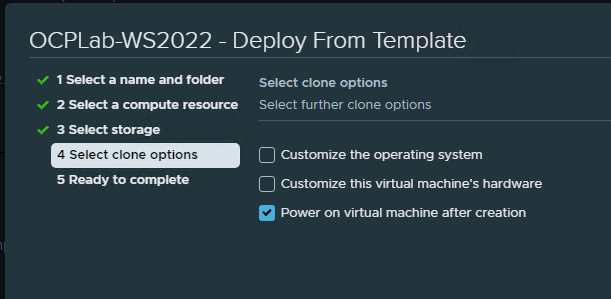

### Rename machine
```powershell
$vmName = "OCPLab-DC1"
$password = ConvertTo-SecureString 'acntorPRESTO!' -AsPlainText -Force
$localhostAdminUser = New-Object System.Management.Automation.PSCredential ('Administrator', $password)
Rename-Computer -NewName $vmName -LocalCredential $localhostAdminUser -Restart
# Reboots
```

### Set Static IP Address

Make sure to **trigger this whole script from ISE**, because RDP will get booted:

```powershell
# In case we want to start with a DHCP assigned range
# $IP = (Get-NetIPAddress | Where-Object {$_.AddressState -eq "Preferred" -and $_.ValidLifetime -lt "24:00:00"}).IPAddress

# Start with an IP that we manually test is empty - i.e. ping $IP
$IP = "10.216.175.4"
$MaskBits = 24 # This means subnet mask = 255.255.255.0 - http://jodies.de/ipcalc?host=255.255.255.0&mask1=24&mask2=
$Gateway = (Get-NetIPConfiguration | Foreach IPv4DefaultGateway | Select NextHop)."NextHop"
$DNS = "127.0.0.1"
$IPType = "IPv4"

# Retrieve the network adapter that you want to configure
$adapter = Get-NetAdapter | ? {$_.Status -eq "up"}

# Remove any existing IP, gateway from our ipv4 adapter
If (($adapter | Get-NetIPConfiguration).IPv4Address.IPAddress) {
 $adapter | Remove-NetIPAddress -AddressFamily $IPType -Confirm:$false
}
If (($adapter | Get-NetIPConfiguration).Ipv4DefaultGateway) {
 $adapter | Remove-NetRoute -AddressFamily $IPType -Confirm:$false
}

 # Configure the IP address and default gateway
$adapter | New-NetIPAddress `
 -AddressFamily $IPType `
 -IPAddress $IP `
 -PrefixLength $MaskBits `
 -DefaultGateway $Gateway

# Configure the DNS client server IP addresses
$adapter | Set-DnsClientServerAddress -ServerAddresses $DNS

# Reconnect RDP from Laptop with MSFTVPN - should work at 10.216.175.4
```
For example - we see:


### Upgrade to a Domain Controller

```powershell
# Configure the Domain Controller
$domainName = 'fg.contoso.com'
$domainAdminPassword = "acntorPRESTO!"
$secureDomainAdminPassword = $domainAdminPassword | ConvertTo-SecureString -AsPlainText -Force

Install-WindowsFeature -Name AD-Domain-Services -IncludeManagementTools

# Create Active Directory Forest
Install-ADDSForest `
    -DomainName "$domainName" `
    -CreateDnsDelegation:$false `
    -DatabasePath "C:\Windows\NTDS" `
    -DomainMode "7" `
    -DomainNetbiosName $domainName.Split('.')[0].ToUpper() `
    -ForestMode "7" `
    -InstallDns:$true `
    -LogPath "C:\Windows\NTDS" `
    -NoRebootOnCompletion:$false `
    -SysvolPath "C:\Windows\SYSVOL" `
    -Force:$true `
    -SafeModeAdministratorPassword $secureDomainAdminPassword

# Reboots - takes 2-3 mins at "Please wait for the Group Policy Client" - it's normal for GPO Policiy initialization
```

Now we can sign-in as Domain Admin `fg\Administrator` to RDP.

### Install DHCP on the Domain Controller

> * https://adamtheautomator.com/dhcp-scope/

```powershell
$dnsServerIP = (Get-NetIPAddress | Where-Object {$_.AddressState -eq "Preferred" -and $_.PrefixLength -eq 24}).IPAddress
# The 24 filter above is because of our mask we set previously

$domainName = 'fg.contoso.com'
$gateway = (Get-NetIPConfiguration | Foreach IPv4DefaultGateway | Select NextHop)."NextHop"
$hostname = hostname

# Install DHCP
Install-WindowsFeature DHCP -IncludeManagementTools

# Add the DHCP scope to this DC server - from VLAN mapping
# Create an IPv4 DHCP Server Scope
$HashArgs = @{
    'Name' = 'VLAN-111';                    # Redmond VLAN mapping
    'Description' = 'Kubernetes CI Lab ';   # This is the human-readable description of the scope
    'StartRange' = '10.216.175.5';          # Specifies the starting IP address in the scope
    'EndRange' = '10.216.175.254';          # Specifies the end IP address in the scope
    'SubnetMask' = '255.255.255.0';         # Specifies the subnet mask of the scope
    'State' = 'Active';                     # Activates the scope
    'LeaseDuration' = '0.00:30:00';         # Specifies the length of the lease duration - 30 mins
}
Add-DhcpServerv4Scope @HashArgs

# Observe the ScopeID just created
$scopeID = (Get-DHCPServerV4Scope)[0].ScopeId.IPAddressToString

# Set Options at the Scope level
Set-DhcpServerv4OptionValue -ScopeID $scopeID -DNSServer $dnsServerIP -DNSDomain $domainName -Router $gateway

# Authorize the DHCP server
Add-DhcpServerInDC -DnsName "$hostname.$domainName"

# Display info about the scope
Get-DhcpServerv4Scope | Select-Object -Property *

# Display leases before adding Client VM
Get-DhcpServerV4Reservation -ScopeID $scopeID

# Get 5 next IP Addresses that are free
Get-DhcpServerv4FreeIPAddress -ScopeID $scopeID -NumAddress 5

# Add Exclusion range for OpenShift Routes

```

As expected, no leases yet:


### Configure DNS forwarder so we can browse the web

```powershell
# Forward to Redmond DNS
Add-DnsServerForwarder -IPAddress "10.50.10.50"

# Validate
Get-DnsServerForwarder

# Check curl to Google
curl google.com

# Forward queries for arclab.local to ArcLab-DC
Add-DnsServerConditionalForwarderZone -Name "arclab.local" -MasterServers "10.216.173.10" # ArcLab-DC.arclab.local
```
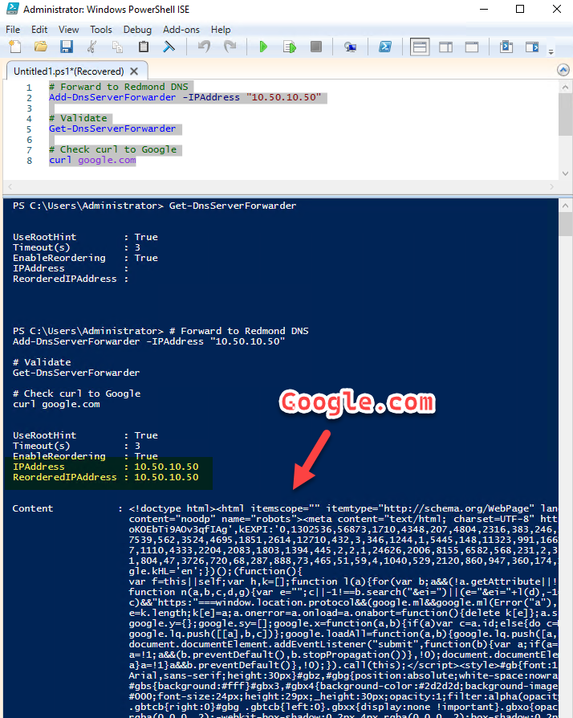

## `OCPLab-DEV-1`

Use the `VM Customization Specifications` to
* Use the vSphere machines name as the hostname
* Auto domain join to `fg.contoso.com`
* Since DHCP is configured above, should get an IP address automatically

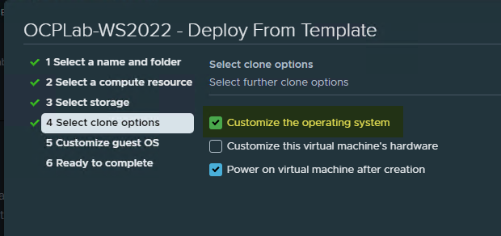

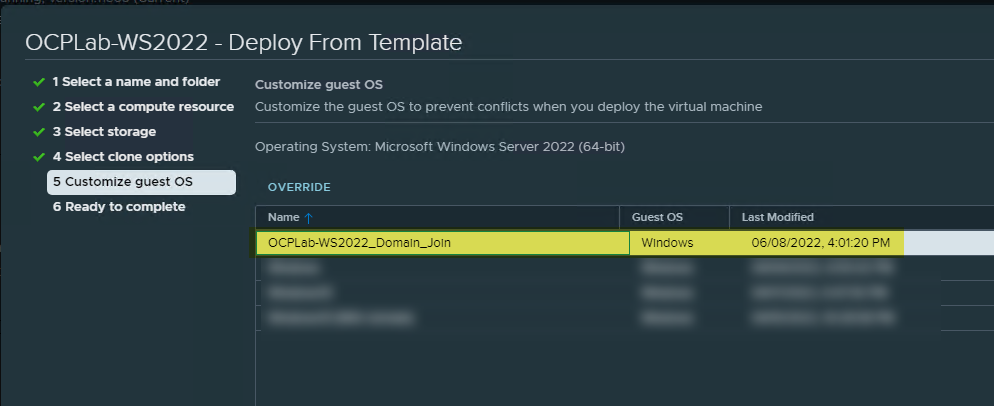

The VM will go through it's reboot cycles to join the domain etc.

Post boot in `OCPLab-DEV1`:
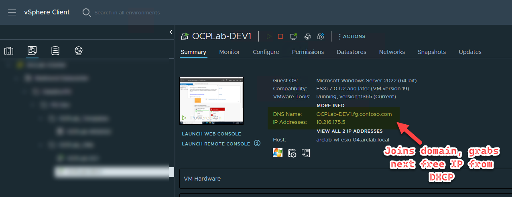

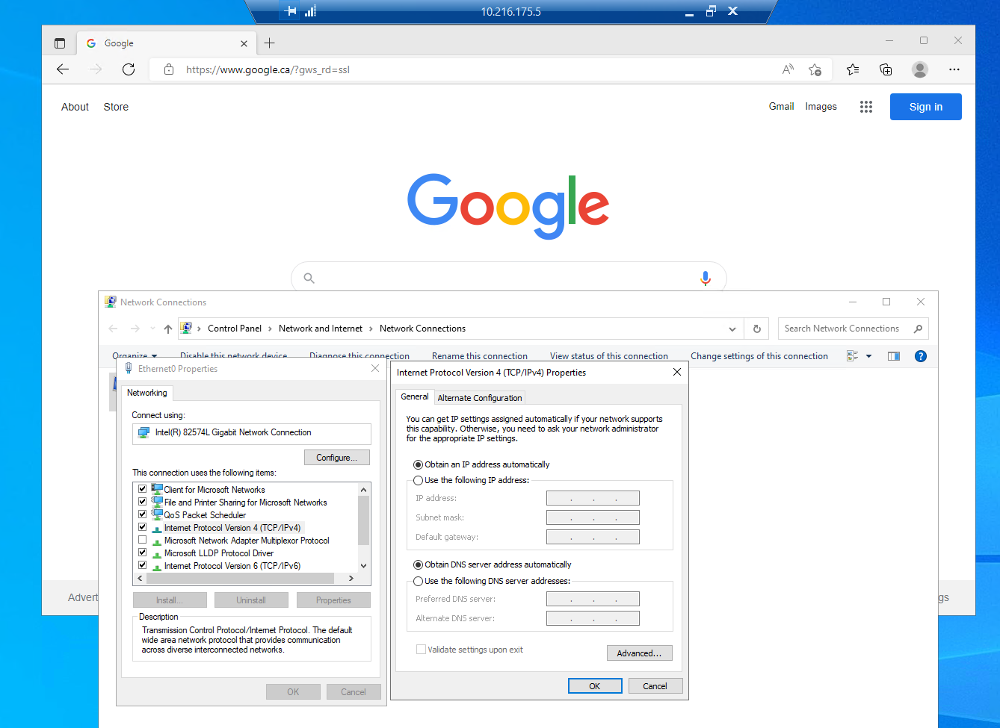

Check leases again in Domain Controller:
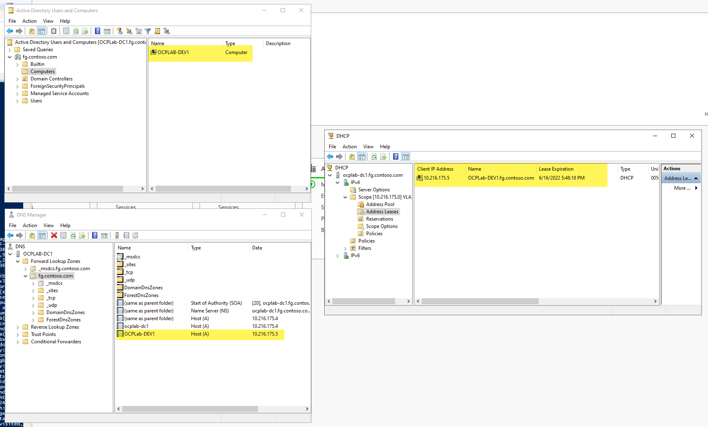

Everything is up!

---

# OpenShift `IPI`-based install - Cluster Name: `arcci`

> `IPI` because we want horizontal scalability on our `MachineSets`

## Add a Reverse Lookup Zone on `OCPLab-DC1`
```powershell
# Add a reverse lookup zone - VLAN 111
Add-DnsServerPrimaryZone -NetworkId "10.216.175.0/24" -ReplicationScope Domain

# Get reverse zone name
$Zones = @(Get-DnsServerZone)
ForEach ($Zone in $Zones) {
    if ((-not $($Zone.IsAutoCreated)) -and ($Zone.IsReverseLookupZone) -and ($Zone.ZoneName.Split(".")[0] -eq "0")) {
       $Reverse = $Zone.ZoneName
    }
}
```

## DNS records for OpenShift in `OCPLab-DC1` - [from here](https://github.com/openshift/installer/blob/master/docs/user/vsphere/vips-dns.md#dns-records)

```PowerShell
$clusterName = 'arcci'
$baseDomain = 'fg.contoso.com'
$ip1 = '10.216.175.6'
$ip2 = '10.216.175.7'

Add-DnsServerResourceRecordA -Name "api.$clusterName" -ZoneName $baseDomain -AllowUpdateAny -IPv4Address $ip1 -TimeToLive 01:00:00 -createptr
Add-DnsServerResourceRecordA -Name "*.apps.$clusterName" -ZoneName $baseDomain -AllowUpdateAny -IPv4Address $ip2 -TimeToLive 01:00:00 -createptr
```

We see:
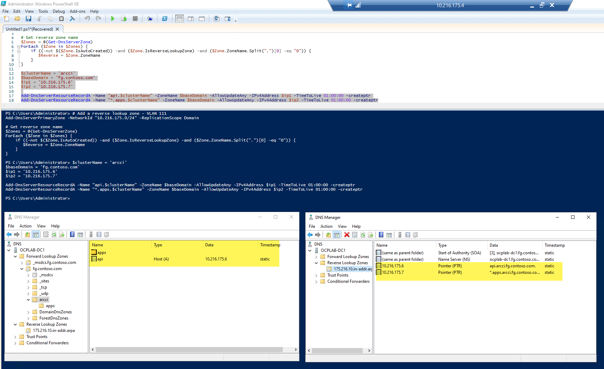

> We are now ready to deploy OpenShift from our container

---
# `devcontainer` prep

```bash
# = = = = = = = = = = = = = = = = = = = 
# DNS Hack for this VSCode Devcontainer
# = = = = = = = = = = = = = = = = = = = 

# We will point this container to use `OCPLab-DC.fg.contoso.com` as the DNS resolver
# Since `OCPLab-DC` has conditional forwarding for `arclab.local`, and the internet (via Redmond resolver), we should be covered
cat << EOF > /etc/resolv.conf
# DNS requests are forwarded to the host. DHCP DNS options are ignored.
nameserver 10.216.175.4                 # OCPLab-DC.fg.contoso.com
EOF

# DNS Tests
nslookup api.arcci.fg.contoso.com
# Address: 10.216.175.6
nslookup console-that-doesnt-exist-yet.apps.arcci.fg.contoso.com
# Address: 10.216.175.7
nslookup quay.io
# Address: 3.227.212.61
nslookup arclab-vc.arclab.local
# Address: 10.216.173.11
nslookup arclab-wl-esxi-02.arclab.local
# Address: 10.216.152.12

# = = = = = = = = = = = = = = = = = = = = = = = = =
# Generate SSH Key pair for Nodes - `DevContainer`
# = = = = = = = = = = = = = = = = = = = = = = = = =
export secretPath='/workspaces/openshift-vsphere-install/openshift-install/secrets'
rm -rf $secretPath
mkdir -p $secretPath/.ssh

# Generate Key Pair
ssh-keygen -t ed25519 -N '' -f $secretPath/.ssh/id_ed25519

# View public key
cat $secretPath/.ssh/id_ed25519.pub
# ssh-ed25519 AAAAC3NzaC...

# Add the SSH private key to `ssh-agent`
eval "$(ssh-agent -s)" # Ensure process is running
# Agent pid 30724

ssh-add $secretPath/.ssh/id_ed25519
# Identity added: /workspaces/openshift-vsphere-install/openshift-install/secrets/.ssh/id_ed25519 ...

# = = = = = = = = = = = = = = = = = = = = = =
# Pulling the OpenShift installation binary
# = = = = = = = = = = = = = = = = = = = = = =
export binaryPath='/workspaces/openshift-vsphere-install/openshift-install/binaries'
rm -rf $binaryPath
mkdir -p $binaryPath
cd $binaryPath

wget https://mirror.openshift.com/pub/openshift-v4/x86_64/clients/ocp/stable/openshift-install-linux.tar.gz
tar -xvf openshift-install-linux.tar.gz
# README.md                 <- useless
# openshift-install         <- useful

mv openshift-install /usr/local/bin/
chmod +x /usr/local/bin/openshift-install
rm README.md

# = = = = = = = = = = = = = = = = = = = = = = = = = 
# Download vCenter root CA Cert into this container
# = = = = = = = = = = = = = = = = = = = = = = = = = 
cd $secretPath
rm -rf certs
wget https://arclab-vc.arclab.local/certs/download.zip --no-check-certificate
unzip download.zip
rm -rf download.zip

# Add certs to Container OS
cp certs/lin/* /usr/local/share/ca-certificates
cp certs/lin/* /etc/ssl/certs
update-ca-certificates --verbose --fresh
# ...
# link Trustwave_Global_Certification_Authority.pem -> f249de83.0
# 127 added, 0 removed; done.
# Running hooks in /etc/ca-certificates/update.d...
# done.
```

> Our devcontainer now has everything it needs to deploy OpenShift

---

## Deploy OCP on vSphere in IPI mode
```bash
export installationDir='/workspaces/openshift-vsphere-install/openshift-install/secrets/installation-assets'
rm -rf $installationDir
mkdir -p $installationDir
cd $installationDir

# Create config file
openshift-install create install-config
# ? Platform vsphere
# ? vCenter arclab-vc.arclab.local
# ? Username your-sa@arclab.local
# ? Password [? for help] **********
# INFO Connecting to vCenter arclab-vc.arclab.local 
# INFO Defaulting to only available datacenter: Your Datacenter 
# INFO Defaulting to only available cluster: ArcLab Workload Cluster 
# INFO Defaulting to only available datastore: ArcLab-NFS-01 
# ? Network DataSvc PG OCP VM Network (VLAN 111)
# ? Virtual IP Address for API 10.216.175.6
# ? Virtual IP Address for Ingress 10.216.175.7
# ? Base Domain fg.contoso.com
# ? Cluster Name arcci
# ? Pull Secret [? for help] ********************************
# INFO Install-Config created in: .

# Fire install
openshift-install create cluster --log-level=debug
# INFO Consuming Install Config from target directory 
# INFO Obtaining RHCOS image file from 'https://rhcos-redirector.apps.art.xq1c.p1.openshiftapps.com/art/storage/releases/rhcos-4.10/410.84.202205191234-0/x86_64/rhcos-410.84.202205191234-0-vmware.x86_64.ova?sha256=' 
# INFO Creating infrastructure resources...

# ....
# DEBUG Still waiting for the Kubernetes API: Get "https://api.arcci.fg.contoso.com:6443/version": dial tcp 10.216.175.6:6443: connect: connection refused 
# INFO API v1.23.5+3afdacb up                       
# INFO Waiting up to 30m0s (until 4:28AM) for bootstrapping to complete... 
#...
# INFO Waiting up to 10m0s (until 9:13PM) for the openshift-console route to be created... 
# DEBUG Route found in openshift-console namespace: console 
# DEBUG OpenShift console route is admitted          
# INFO Install complete!                            
# INFO To access the cluster as the system:admin user when using 'oc', run 'export KUBECONFIG=/workspaces/openshift-vsphere-install/openshift-install/secrets/installation-assets/auth/kubeconfig' 
# INFO Access the OpenShift web-console here: https://console-openshift-console.apps.arcci.fg.contoso.com 
# INFO Login to the console with user: "kubeadmin", and password: "..." 
# DEBUG Time elapsed per stage:                      
# DEBUG      pre-bootstrap: 1m18s                    
# DEBUG          bootstrap: 37s                      
# DEBUG             master: 53s                      
# DEBUG Bootstrap Complete: 9m58s                    
# DEBUG                API: 57s                      
# DEBUG  Bootstrap Destroy: 24s                      
# DEBUG  Cluster Operators: 14m22s                   
# INFO Time elapsed: 29m15s  
# 

# Test access
export KUBECONFIG=/workspaces/openshift-vsphere-install/openshift-install/secrets/installation-assets/auth/kubeconfig

oc get nodes
# NAME                       STATUS   ROLES    AGE   VERSION
# arcci-jlzvv-master-0       Ready    master   40m   v1.23.5+3afdacb
# arcci-jlzvv-master-1       Ready    master   40m   v1.23.5+3afdacb
# arcci-jlzvv-master-2       Ready    master   40m   v1.23.5+3afdacb
# arcci-jlzvv-worker-sfxxl   Ready    worker   40m   v1.23.5+3afdacb
# arcci-jlzvv-worker-wclv7   Ready    worker   38m   v1.23.5+3afdacb
# arcci-jlzvv-worker-zpng2   Ready    worker   40m   v1.23.5+3afdacb
```

Complete:

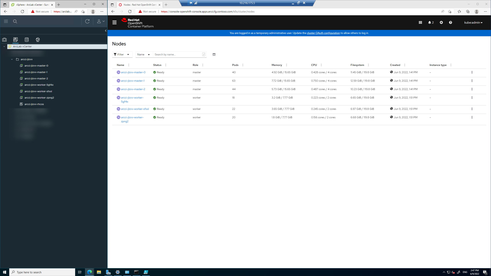

## Access `oc` and vSphere from `OCPLab-DEV-1`

```PowerShell
# Download oc cli
$chocoPath = "C:\ProgramData\chocolatey\bin"
$ocPath = "https://access.cdn.redhat.com/content/origin/files/sha256/b5/b5be74fba204c3c71f14ad9f20c4432215861b9e83008bd597445b77b7d71aec/oc-4.10.17-windows.zip?user=9f0797baa5932892e224995847e5b117&_auth_=1654762464_3d3e28adce1ce122828a13a5a48c87f4"
$downloadZip = "oc-4.10.17-windows.zip"

cd $chocoPath
Invoke-WebRequest $ocPath -OutFile "$chocoPath\$downloadZip"
Expand-Archive -Path $downloadZip -DestinationPath $chocoPath
rm README.md
```

## Clean destroy

```bash
openshift-install destroy cluster --dir $installationDir
# INFO Destroyed                                     VirtualMachine=arcci-7p7gn-rhcos
# INFO Destroyed                                     VirtualMachine=arcci-7p7gn-bootstrap
# INFO Destroyed                                     VirtualMachine=arcci-7p7gn-master-2
# INFO Destroyed                                     VirtualMachine=arcci-7p7gn-master-1
# INFO Destroyed                                     VirtualMachine=arcci-7p7gn-master-0
# INFO Destroyed                                     Folder=arcci-7p7gn
# INFO Destroyed                                     Tag=arcci-7p7gn
# INFO Destroyed                                     TagCategory=openshift-arcci-7p7gn
# INFO Time elapsed: 10s 
rm -rf $installationDir
```

---

# Post deploy enhancements

## Ensure master nodes are unschedulable

> Ref: https://access.redhat.com/documentation/en-us/openshift_container_platform/4.2/html/nodes/working-with-nodes#nodes-nodes-working-master-schedulable_nodes-nodes-working

```bash
oc get schedulers cluster -o yaml | yq .spec.mastersSchedulable
# false
```

## LDAP for sign-in

> Ref: 
> * https://docs.openshift.com/container-platform/4.7/authentication/identity_providers/configuring-ldap-identity-provider.html
> * https://youtu.be/RG6xt2q72nw?t=2508
> * https://gist.github.com/acsulli/5acdb1de102b4771553bb9e4b458cb21
> * https://docs.openshift.com/container-platform/4.7/authentication/ldap-syncing.html#ldap-syncing-nesting_ldap-syncing-groups
> * https://github.com/redhat-cop/group-sync-operator

### Disable self-provisioning

> Ref: https://docs.openshift.com/container-platform/4.10/applications/projects/configuring-project-creation.html#disabling-project-self-provisioning_configuring-project-creation

Because stops from random people using up compute.

```bash
# Remove system:authenticated:oauth group from self-provisioners ClusterRoleBinding
oc patch clusterrolebinding.rbac self-provisioners -p '{"subjects": null}'

# Remove auto-update
oc patch clusterrolebinding.rbac self-provisioners -p '{ "metadata": { "annotations": { "rbac.authorization.kubernetes.io/autoupdate": "false" } } }'

# Customize message
cat <<EOF | oc apply -f -
apiVersion: config.openshift.io/v1
kind: Project
metadata:
    name: cluster
spec:
    projectRequestMessage: This cluster is for Arc CI only, you may not create a new Project manually.
EOF
```

### LDAP configuration on `OCPLab-DC1`

#### Create AD demo objects
* OU: `Arc CI`
* 2 groups:
    * `arcci-users`
    * `arcci-admins`
* 1 users:
    * `boor` - `arcci-users`
    * `Administrator` (existing) - `arcci-admins`
* 1 sa:
    * `openshift-sa` - for authenticating LDAP users

```powershell
Import-Module ActiveDirectory

# New OUs
New-ADOrganizationalUnit -Name "Arc CI" -Path "DC=FG,DC=CONTOSO,DC=COM"
New-ADOrganizationalUnit -Name "Users" -Path "OU=Arc CI,DC=FG,DC=CONTOSO,DC=COM"
New-ADOrganizationalUnit -Name "Admins" -Path "OU=Arc CI,DC=FG,DC=CONTOSO,DC=COM"
New-ADOrganizationalUnit -Name "Service Accounts" -Path "OU=Arc CI,DC=FG,DC=CONTOSO,DC=COM"
New-ADOrganizationalUnit -Name "Groups" -Path "OU=Arc CI,DC=FG,DC=CONTOSO,DC=COM"

# Create Users/SAs (same thing)
$pass = "acntorPRESTO!" | ConvertTo-SecureString -AsPlainText -Force

New-ADUser -Name "boor" `
           -UserPrincipalName "boor@fg.contoso.com" `
           -Path "OU=Users,OU=Arc CI,DC=FG,DC=CONTOSO,DC=COM" `
           -AccountPassword $pass `
           -Enabled $true `
           -ChangePasswordAtLogon $false `
           -PasswordNeverExpires $true

New-ADUser -Name "openshift-sa" `
           -UserPrincipalName "openshift-sa@fg.contoso.com" `
           -Path "OU=Service Accounts,OU=Arc CI,DC=FG,DC=CONTOSO,DC=COM" `
           -AccountPassword $pass `
           -Enabled $true `
           -ChangePasswordAtLogon $false `
           -PasswordNeverExpires $true

# Create Groups
New-ADGroup -Name "arcci-users" `
            -SamAccountName arcci-users `
            -GroupCategory Security `
            -GroupScope Universal `
            -DisplayName "Arc CI Env Regular Users" `
            -Path "OU=Groups,OU=Arc CI,DC=FG,DC=CONTOSO,DC=COM" `
            -Description "Members of this group are Arc CI Environment - e.g. OpenShift - regular users"

New-ADGroup -Name "arcci-admins" `
            -SamAccountName arcci-admins `
            -GroupCategory Security `
            -GroupScope Universal `
            -DisplayName "Arc CI Env Admin Users" `
            -Path "OU=Groups,OU=Arc CI,DC=FG,DC=CONTOSO,DC=COM" `
            -Description "Members of this group are Arc CI Environment - e.g. OpenShift - administrators"

# Assign Users to Groups
Add-ADGroupMember -Identity arcci-users -Members boor
Add-ADGroupMember -Identity arcci-admins -Members Administrator

# Move my Administrator user to this OU
Get-ADUser -Identity Administrator | Move-ADObject -TargetPath "OU=Users,OU=Arc CI,DC=FG,DC=CONTOSO,DC=COM"
```

We see:


#### Configure OpenShift AuthN

```bash
# Create a secret for the bindDN SA - openshift-sa - password
oc create secret generic ldap-bind-secret \
  --from-literal=bindPassword=acntorPRESTO! \
  -n openshift-config

# Validate bind
ldapsearch -h fg.contoso.com -x -D "CN=openshift-sa,OU=Service Accounts,OU=Arc CI,DC=FG,DC=CONTOSO,DC=COM" -w "acntorPRESTO!" -p 389 -b "DC=FG,DC=CONTOSO,DC=COM" -s sub "sAMAccountName=openshift-sa"
# ref: ldap://fg.contoso.com/CN=Configuration,DC=fg,DC=contoso,DC=com
# search result
# search: 2
# result: 0 Success
# numResponses: 5
# numEntries: 1
# numReferences: 3

# Operator status before apply
oc get co | grep authentication -B 1
# NAME                                       VERSION   AVAILABLE   PROGRESSING   DEGRADED   SINCE   MESSAGE
# authentication                             4.10.16   True        False         False      41h

# Create the OAuth config file, insecure because we don't have a CA
cat <<EOF | oc apply -f -
apiVersion: config.openshift.io/v1
kind: OAuth
metadata:
  name: cluster
spec:
  identityProviders:
    - ldap:
        attributes:
          email:
            - mail
          id:
            - sAMAccountName
          name:
            - cn
          preferredUsername:
            - sAMAccountName
        bindDN: CN=openshift-sa,OU=Service Accounts,OU=Arc CI,DC=FG,DC=CONTOSO,DC=COM
        bindPassword:
          name: ldap-bind-secret
        insecure: true
        url: "ldap://fg.contoso.com/OU=Arc CI,DC=FG,DC=CONTOSO,DC=COM?sAMAccountName?sub?(&(objectClass=user)(|(memberOf:1.2.840.113556.1.4.1941:=CN=arcci-admins,OU=Groups,OU=Arc CI,DC=FG,DC=CONTOSO,DC=COM)(memberOf:1.2.840.113556.1.4.1941:=CN=arcci-users,OU=Groups,OU=Arc CI,DC=FG,DC=CONTOSO,DC=COM)))"
      mappingMethod: claim
      name: fg.contoso.com
      type: LDAP
EOF

# We see
oc get co | grep authentication -B 1
# NAME                                       VERSION   AVAILABLE   PROGRESSING   DEGRADED   SINCE   MESSAGE
# authentication                             4.10.16   True        True          False      41h     OAuthServerDeploymentProgressing: deployment/oauth-openshift.openshift-authentication: 2/3 pods have been updated to the latest generation

# NAME                                       VERSION   AVAILABLE   PROGRESSING   DEGRADED   SINCE   MESSAGE
# authentication                             4.10.16   True        False         False      41h  

# At this point, authentication will work
```
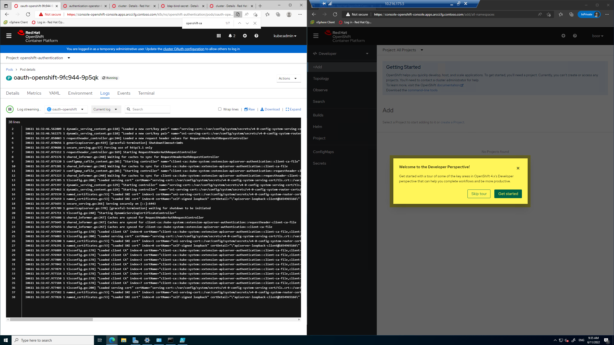

#### Configure Group Sync and AuthZ

> Ref:
> * https://gist.github.com/acsulli/5acdb1de102b4771553bb9e4b458cb21#group-sync-cronjob
> * https://examples.openshift.pub/cluster-configuration/authentication/activedirectory-ldap/#deploy-recular-sync-via-cronjobscheduledjob

```bash
export authZ="/workspaces/openshift-vsphere-install/AuthZ"
rm -rf $authZ
mkdir -p $authZ
cd $authZ

# Create the group sync config file
# the groupUIDNameMapping is added to avoid spaces in the group names
cat << EOF > ldap-sync.yaml
kind: LDAPSyncConfig
apiVersion: v1
url: ldap://fg.contoso.com
bindDN: CN=openshift-sa,OU=Service Accounts,OU=Arc CI,DC=FG,DC=CONTOSO,DC=COM
bindPassword: 'acntorPRESTO!'
insecure: true
groupUIDNameMapping:
  "CN=arcci-users,OU=Groups,OU=Arc CI,DC=FG,DC=CONTOSO,DC=COM": arcci-users
  "CN=arcci-admins,OU=Groups,OU=Arc CI,DC=FG,DC=CONTOSO,DC=COM": arcci-admins
augmentedActiveDirectory:
  groupsQuery:
    derefAliases: never
    pageSize: 0
  groupUIDAttribute: dn
  groupNameAttributes: [ cn ]
  usersQuery:
    baseDN: "OU=Arc CI,DC=FG,DC=CONTOSO,DC=COM"
    scope: sub
    derefAliases: never
    filter: (objectclass=person)
    pageSize: 0
  userNameAttributes: [ sAMAccountName ]
  groupMembershipAttributes: [ "memberOf:1.2.840.113556.1.4.1941:" ]
EOF

# Since we're using nested groups, we'll need an allow list as well
cat << EOF > group-allowlist.txt
CN=arcci-users,OU=Groups,OU=Arc CI,DC=FG,DC=CONTOSO,DC=COM
CN=arcci-admins,OU=Groups,OU=Arc CI,DC=FG,DC=CONTOSO,DC=COM
EOF

# Group Sync CronJob
oc create ns ldap-sync

# Create a Secret with the relevant files
oc create secret generic ldap-sync -n ldap-sync \
 --from-file=ldap-sync.yaml=ldap-sync.yaml \
 --from-file=group-allowlist.txt=group-allowlist.txt

# ClusterRole
oc create clusterrole ldap-group-sync \
 --verb=create,update,patch,delete,get,list \
 --resource=groups.user.openshift.io

# Create a Project, ServiceAccount, and ClusterRoleBinding
oc create sa ldap-sync -n ldap-sync
oc adm policy add-cluster-role-to-user ldap-group-sync \
  -z ldap-sync \
  -n ldap-sync

# Create the CronJob
cat << EOF | oc apply -f -
apiVersion: batch/v1beta1
kind: CronJob
metadata:
  name: ldap-group-sync
  namespace: ldap-sync
spec:
  schedule: "*/30 * * * *"
  suspend: false
  jobTemplate:
    spec:
      template:
        spec:
          serviceAccountName: ldap-sync
          restartPolicy: Never
          containers:
            - name: oc-cli
              command:
                - /bin/oc
                - adm
                - groups
                - sync
                - --whitelist=/ldap-sync/group-allowlist.txt
                - --sync-config=/ldap-sync/ldap-sync.yaml
                - --confirm
              image: registry.redhat.io/openshift4/ose-cli
              imagePullPolicy: Always
              volumeMounts:
              - mountPath: /ldap-sync/
                name: config
                readOnly: true
          volumes:
          - name: config
            secret:
              defaultMode: 420
              secretName: ldap-sync
EOF

# Validate
oc get groups
# NAME           USERS
# arcci-admins   Administrator
# arcci-users    boor

# Assign RBAC to group
oc adm policy add-cluster-role-to-group cluster-admin arcci-admins
oc adm policy add-cluster-role-to-group cluster-reader arcci-users
```

We see:

`boor` - read-only:


`Administrator` - read-write:
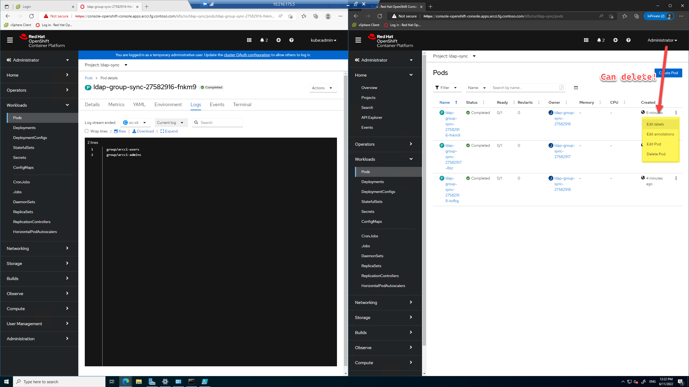

> Also, note that `boor` cannot read Secrets - which is good.

---

## vSphere CSI

> Ref:
> * https://docs.openshift.com/container-platform/4.10/storage/container_storage_interface/persistent-storage-csi-vsphere.html
> * https://docs.openshift.com/container-platform/4.10/storage/persistent_storage/persistent-storage-vsphere.html
> * (`RWO` looks like) https://docs.openshift.com/container-platform/4.10/storage/understanding-persistent-storage.html#pv-access-modes_understanding-persistent-storage

Looks like we get this for free with IPI!
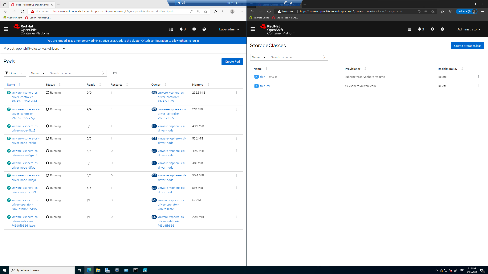

We change the default `storageclass`
```bash
oc patch storageclass thin -p '{"metadata": {"annotations":{"storageclass.kubernetes.io/is-default-class":"false"}}}'
oc patch storageclass thin-csi -p '{"metadata": {"annotations":{"storageclass.kubernetes.io/is-default-class":"true"}}}'
# NAME                 PROVISIONER                    RECLAIMPOLICY   VOLUMEBINDINGMODE      ALLOWVOLUMEEXPANSION   AGE
# thin                 kubernetes.io/vsphere-volume   Delete          Immediate              false                  2d2h
# thin-csi (default)   csi.vsphere.vmware.com         Delete          WaitForFirstConsumer   true                   2d2h
```

Let's test it:
```bash
cat << EOF | oc apply -f -
apiVersion: v1
kind: Namespace
metadata:
  name: vspherecsitest
---
apiVersion: "v1"
kind: PersistentVolumeClaim
metadata:
  name: claim1
  namespace: vspherecsitest
spec:
  accessModes:
    - ReadWriteOnce
  resources:
    requests:
      storage: 1Gi 
  storageClassName: thin-csi
---
apiVersion: v1
kind: Pod
metadata:
  name: nginx
  namespace: vspherecsitest
spec:
  containers:
  - name: task-pv-container
    image: nginx
    ports:
      - containerPort: 80
        name: "http-server"
    volumeMounts:
    - mountPath: "/data" 
      name: vsphere-csi-vol
  volumes:
    - name: vsphere-csi-vol
      persistentVolumeClaim:
        claimName: claim1 
EOF

# Create a couple files in the Pod
oc exec -it nginx -n vspherecsitest -- /bin/sh
# 
touch /data/myfile.txt
apt-get update && apt-get install -y wget
wget https://github.com/Microsoft/sql-server-samples/releases/download/adventureworks/AdventureWorks2019.bak -O /data/AdventureWorks2019.bak

# ls -lR
total 212104 # 212 MB
-rw-rw-rw-. 1 root root 217178112 Dec  8  2021 AdventureWorks2019.bak
drwx------. 2 root root     16384 Jun 26 10:57 lost+found
-rw-rw-rw-. 1 root root         0 Jun 26 10:59 myfile.txt
```

Before downloading large file:
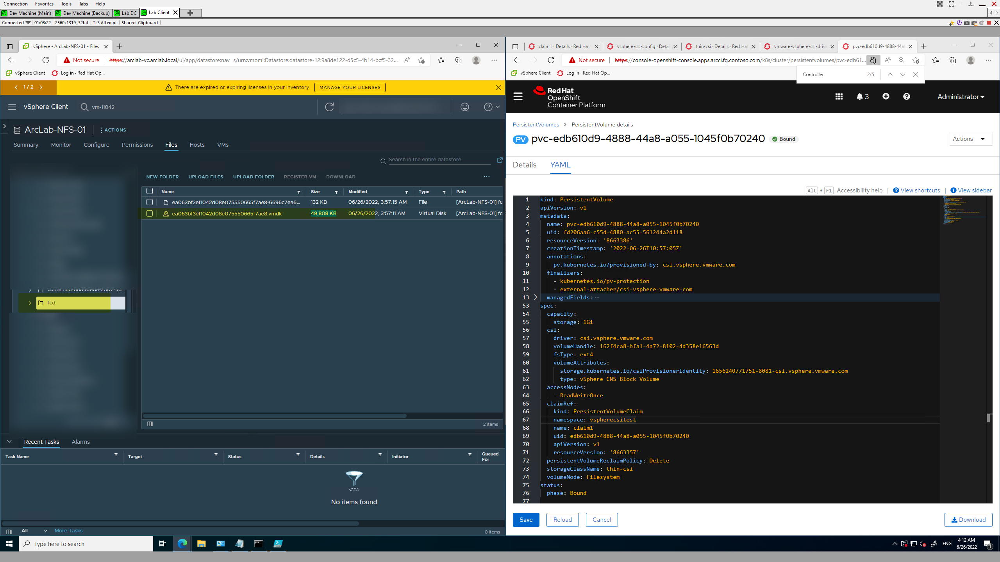

After:
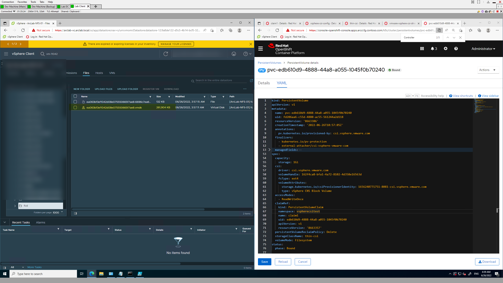

---

## New `MachineSet`

> Ref:
> * https://docs.openshift.com/container-platform/4.10/machine_management/creating_machinesets/creating-machineset-vsphere.html
> * https://access.redhat.com/documentation/en-us/openshift_container_platform/4.7/html/machine_management/creating-infrastructure-machinesets
> * https://www.youtube.com/watch?v=3no-WT557ls&ab_channel=OCPdude
> * https://medium.com/@wintonjkt/machinesets-and-auto-scaling-openshift-cluster-a24c458a200a

### Clean YAML generator
```bash
export type='machineset'
export original_name='arcci-jlzvv-worker'
export namespace='openshift-machine-api'

oc get $type $original_name  -n $namespace -o=json | jq 'del(.metadata.resourceVersion,.metadata.uid,.metadata.selfLink,.metadata.creationTimestamp,.metadata.annotations,.metadata.generation,.metadata.ownerReferences,.status,.spec.template.spec.lifecycleHooks,.spec.template.spec.metadata,.spec.template.spec.providerSpec.value.metadata)' | yq eval . --prettyPrint
```

### Apply big MachineSet
```bash
# Variables
export infra_id=$(oc get -o jsonpath='{.status.infrastructureName}{"\n"}' infrastructure cluster)
export name='worker-big'
export replicas='3'
export disk='200'
export mem='20480'
export cpu='14'
export network='DataSvc PG OCP VM Network (VLAN 111)'
export datacenter='Redmond Datacenter'
export server='arclab-vc.arclab.local'
export datastore='ArcLab-NFS-01'
export resourcepool='ArcLab Workload Cluster'

# Add "--dry-run=client" for dry run
cat << EOF | oc apply -f -
apiVersion: machine.openshift.io/v1beta1
kind: MachineSet
metadata:
  labels:
    machine.openshift.io/cluster-api-cluster: ${infra_id}
  name: ${infra_id}-${name}
  namespace: openshift-machine-api
spec:
  replicas: ${replicas}
  selector:
    matchLabels:
      machine.openshift.io/cluster-api-cluster: ${infra_id}
      machine.openshift.io/cluster-api-machineset: ${infra_id}-${name}
  template:
    metadata:
      labels:
        machine.openshift.io/cluster-api-cluster: ${infra_id}
        machine.openshift.io/cluster-api-machine-role: worker
        machine.openshift.io/cluster-api-machine-type: worker
        machine.openshift.io/cluster-api-machineset: ${infra_id}-${name}
    spec:
      providerSpec:
        value:
          apiVersion: machine.openshift.io/v1beta1
          credentialsSecret:
            name: vsphere-cloud-credentials
          diskGiB: ${disk}
          kind: VSphereMachineProviderSpec
          memoryMiB: ${mem}
          network:
            devices:
              - networkName: ${network}
          numCPUs: ${cpu}
          numCoresPerSocket: 2
          snapshot: ""
          template: ${infra_id}-rhcos
          userDataSecret:
            name: worker-user-data
          workspace:
            datacenter: ${datacenter}
            datastore: ${datastore}
            folder: /${datacenter}/vm/${infra_id}
            resourcePool: /${datacenter}/host/${resourcepool}/Resources
            server: ${server}
EOF
# machineset.machine.openshift.io/arcci-jlzvv-worker-big created
```

We see the VMs getting created:
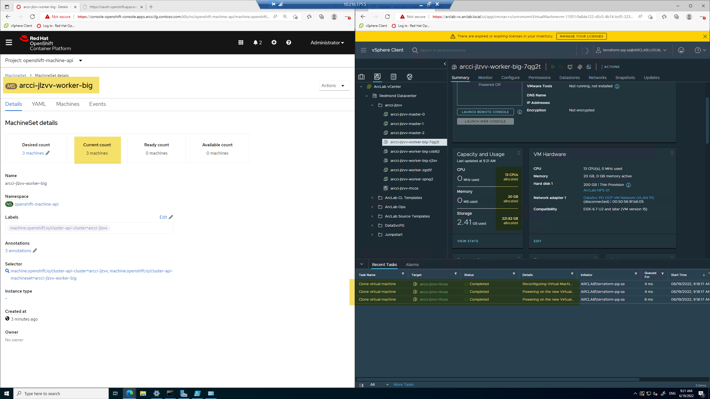

And we see events per machine:
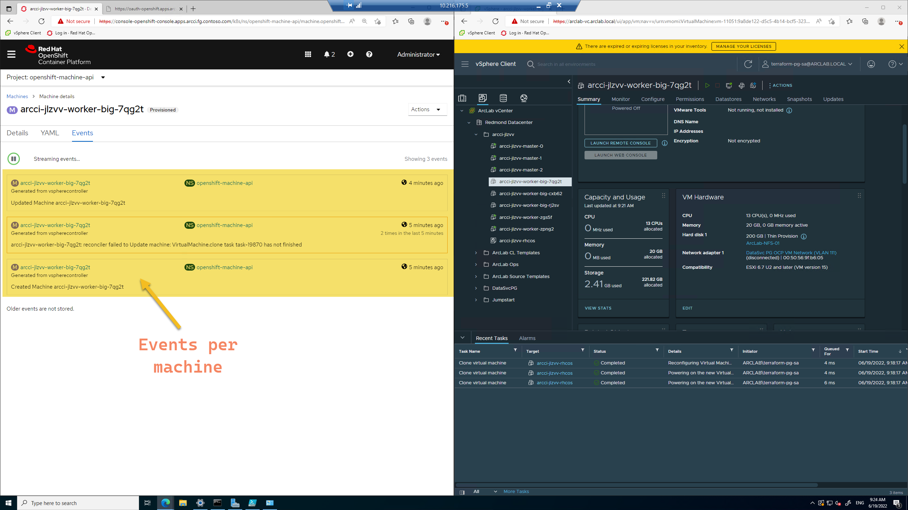

---

## `RWX` via Azure Files

> Ref:
> * https://docs.openshift.com/container-platform/4.10/post_installation_configuration/storage-configuration.html#azure-file-definition_post-install-storage-configuration
> * https://docs.openshift.com/container-platform/4.9/storage/persistent_storage/persistent-storage-azure-file.html
> * https://docs.openshift.com/container-platform/3.11/install_config/persistent_storage/persistent_storage_azure_file.html
> * https://docs.microsoft.com/en-us/azure/openshift/howto-create-a-storageclass
> * https://blog.cloudtrooper.net/2021/05/25/mounting-azure-files-shares-from-openshift/
> * https://kubernetes.io/docs/concepts/storage/storage-classes/#azure-file
> * https://github.com/kubernetes-sigs/azurefile-csi-driver
> * https://github.com/kubernetes-sigs/azurefile-csi-driver/blob/e38436385ceca271d8d9023d6ff155b4de4c924a/deploy/example/e2e_usage.md
> * https://github.com/kubernetes-sigs/azurefile-csi-driver/blob/d5188bec18eca5e7f305fba8d630b8cb5bf14f81/docs/driver-parameters-intree.md
> * https://github.com/ezYakaEagle442/aro-pub-storage/blob/master/setup-store-CSI-driver-azure-file.md
> * https://githubmemory.com/repo/kubernetes-sigs/blob-csi-driver/issues/266
> * https://faun.pub/dynamic-provisioning-using-azure-files-container-storage-interface-csi-drivers-784034cb3978
> * https://github.com/ezYakaEagle442/aro-pub-storage/blob/master/setup-store-CSI-driver-azure-file.md
> * https://access.redhat.com/documentation/en-us/openshift_container_platform/4.10/html/storage/using-container-storage-interface-csi#csi-tp-enable_persistent-storage-csi-azure-file
> * https://access.redhat.com/documentation/en-us/openshift_container_platform/4.10/html/nodes/working-with-clusters#nodes-cluster-enabling

Create `ClusterRole` and add to `ServiceAccount`:
```bash
cat << EOF | oc apply -f -
apiVersion: rbac.authorization.k8s.io/v1
kind: ClusterRole
metadata:
  name: system:azure-cloud-provider
rules:
- apiGroups: ['']
  resources: ['secrets']
  verbs:     ['get','create']
EOF
# clusterrole.rbac.authorization.k8s.io/system:azure-cloud-provider created

# Bind ClusterRole to ServiceAccount
oc adm policy add-cluster-role-to-user system:azure-cloud-provider system:serviceaccount:kube-system:persistent-volume-binder
# clusterrole.rbac.authorization.k8s.io/system:azure-cloud-provider added: "system:serviceaccount:kube-system:persistent-volume-binder"
```

> Should do this^ via Terraform instead

### Testing Static provisioning

#### Using Terraform

Create Storage Account and `StorageClass` via Terraform:

```bash
# ---------------------
# ENVIRONMENT VARIABLES
# For Terraform
# ---------------------
# Azure
export TF_VAR_SPN_CLIENT_ID=$spnClientId
export TF_VAR_SPN_CLIENT_SECRET=$spnClientSecret
export TF_VAR_SPN_TENANT_ID=$spnTenantId
export TF_VAR_SPN_SUBSCRIPTION_ID=$subscriptionId
export TF_VAR_prefix="ocpvspherearc"
export TF_VAR_file_share_name="fls-1"
export TF_VAR_file_share_size=75

# OCP
export kube_context="kubectl config view --minify --flatten --context=admin"
export TF_VAR_host=$(eval "$kube_context" | yq .clusters[0].cluster.server)
export TF_VAR_client_certificate=$(eval "$kube_context" | yq .users[0].user.client-certificate-data)
export TF_VAR_client_key=$(eval "$kube_context" | yq .users[0].user.client-key-data)
export TF_VAR_cluster_ca_certificate=$(eval "$kube_context" | yq .clusters[0].cluster.certificate-authority-data)

# ---------------------
# DEPLOY TERRAFORM
# ---------------------
cd /workspaces/openshift-vsphere-install/terraform
terraform init
terraform plan
terraform apply -auto-approve

# Outputs:

# storage_account_name = "ocpvspherearcsa87a8dc4c"
# storage_class_name = "azure-file"
# storage_class_secret_name = "azure-file-ocpvspherearcsa87a8dc4c-csi-driver-secret"
# storage_class_secret_namespace = "openshift-cluster-csi-drivers"

export secretName=$(terraform output --raw storage_class_secret_name)
export secretNamespace=$(terraform output --raw storage_class_secret_namespace)
export shareName='fls-1' # Can get TF to spit this out
```

### Test

Deploy Test Pod with `azure-file`, `RWX` PVC:

```bash
cat << EOF | oc apply -f -
apiVersion: v1
kind: Namespace
metadata:
  name: azfiletest
---
apiVersion: v1
kind: PersistentVolume
metadata:
  name: pv0001
spec:
  capacity:
    storage: 5Gi
  accessModes:
    - ReadWriteMany
  storageClassName: azure-file
  azureFile:
    secretName: $secretName
    secretNamespace: $secretNamespace
    shareName: $shareName
    readOnly: false
---
apiVersion: v1
kind: PersistentVolumeClaim
metadata:
  name: claim1
  namespace: azfiletest
spec:
  accessModes:
    - ReadWriteMany
  resources:
    requests:
      storage: 5Gi
  storageClassName: azure-file
  volumeName: pv0001
---
apiVersion: v1
kind: Pod
metadata:
  name: nginx
  namespace: azfiletest
spec:
  containers:
  - name: task-pv-container
    image: nginx
    ports:
      - containerPort: 80
        name: "http-server"
    volumeMounts:
    - mountPath: "/data" 
      name: azure-file-share
  volumes:
    - name: azure-file-share
      persistentVolumeClaim:
        claimName: claim1 
EOF

oc exec -it nginx -n azfiletest -- /bin/sh
# 
touch /data/myfile.txt
```

And we see our file in the file share:
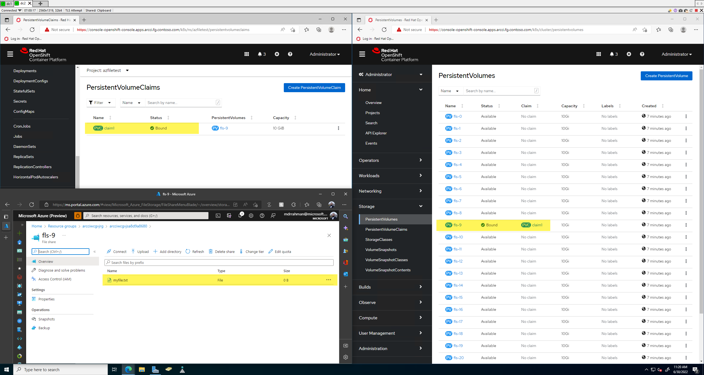

> The downside here is - we need to create a File Share manually every time, which is silly. I guess we could have pre-created Fileshares and PVs but that's also silly.

### Testing Dynamic provisioning

#### Attempt 1 - Fail

```bash
# Secret for cloud.conf
kubectl create secret generic azure-cloud-provider -n kube-system --from-file=cloud.conf=/workspaces/openshift-vsphere-install/fls-test/cloud.conf

# Secret for Storage Account
kubectl create secret generic azure-secret --from-literal azurestorageaccountname=... --from-literal azurestorageaccountkey="...w==" --type=Opaque

# Create StorageClass
cat << EOF  | oc apply -f -
apiVersion: storage.k8s.io/v1
kind: StorageClass
metadata:
  name: azurefile-csi
provisioner: file.csi.azure.com
allowVolumeExpansion: true
parameters:
  provisioner-secret-name: azure-secret
  provisioner-secret-namespace: default
  node-stage-secret-name: azure-secret
  node-stage-secret-namespace: default
  controller-expand-secret-name: azure-secret
  controller-expand-secret-namespace: default
mountOptions:
  - dir_mode=0777
  - file_mode=0777
  - uid=0
  - gid=0
  - mfsymlinks
  - cache=strict  # https://linux.die.net/man/8/mount.cifs
  - nosharesock  # reduce probability of reconnect race
  - actimeo=30  # reduce latency for metadata-heavy workload
EOF

# Deploy an STS that uses it
cat << EOF | oc apply -f -
apiVersion: apps/v1
kind: StatefulSet
metadata:
  name: statefulset-azurefile
  labels:
    app: nginx
spec:
  podManagementPolicy: Parallel  # default is OrderedReady
  serviceName: statefulset-azurefile
  replicas: 1
  template:
    metadata:
      labels:
        app: nginx
    spec:
      nodeSelector:
        "kubernetes.io/os": linux
      containers:
        - name: statefulset-azurefile
          image: mcr.microsoft.com/oss/nginx/nginx:1.19.5
          command:
            - "/bin/bash"
            - "-c"
            - set -euo pipefail; while true; do echo $(date) >> /mnt/azurefile/outfile; sleep 1; done
          volumeMounts:
            - name: persistent-storage
              mountPath: /mnt/azurefile
  updateStrategy:
    type: RollingUpdate
  selector:
    matchLabels:
      app: nginx
  volumeClaimTemplates:
  - metadata:
      name: persistent-storage
    spec:
      accessModes: [ "ReadWriteOnce" ]
      storageClassName: "azurefile-csi"
      resources:
        requests:
          storage: 1Gi
EOF
```

#### Attempt 2: Using CTP on OCP - Fail

```bash
# Patch to enable Preview features
oc patch featuregate cluster -p='{ "spec": { "featureSet": "TechPreviewNoUpgrade" } }' --type=merge

oc get featuregate cluster -o yaml
# apiVersion: config.openshift.io/v1
# kind: FeatureGate
# ...
# spec:
#   featureSet: TechPreviewNoUpgrade <---

# All nodes will go through new config rotations
oc get nodes
# NAME                           STATUS                     ROLES    AGE     VERSION
# arcci-jlzvv-master-0           Ready                      master   16d     v1.23.5+3afdacb
# arcci-jlzvv-master-2           Ready,SchedulingDisabled   master   16d     v1.23.5+3afdacb
# arcci-jlzvv-master-3           Ready                      master   6d17h   v1.23.5+3afdacb

# Validate after it comes back to ready
oc debug node/arcci-jlzvv-master-2
chroot /host
cat /etc/kubernetes/kubelet.conf
# "featureGates": {
#   "APIPriorityAndFairness": true,
#   "BuildCSIVolumes": true,
#   "CSIDriverAzureDisk": true,
#   "CSIDriverAzureFile": true,           <---
#   "CSIDriverSharedResource": true,

# Looking good!

# Now, if we immediately check the Cluster Operator:
oc get co storage
# NAME      VERSION   AVAILABLE   PROGRESSING   DEGRADED   SINCE   MESSAGE
# storage   4.10.16   True        True          False      5m2s    VSphereCSIDriverOperatorCRProgressing: VMwareVSphereDriverControllerServiceControllerProgressing: Waiting for Deployment to deploy pods...
```

We want, according to [this](https://access.redhat.com/documentation/en-us/openshift_container_platform/4.10/html/storage/using-container-storage-interface-csi#csi-tp-enable_persistent-storage-csi-azure-file):
* AVAILABLE should be "True".
* PROGRESSING should be "False".
* DEGRADED should be "False".

Waiting a few more minutes till nodes are done rotating:

```bash
NAME      VERSION   AVAILABLE   PROGRESSING   DEGRADED   SINCE   MESSAGE
storage   4.10.16   True        False         False      42s
```

And let's validate our pods in the CSI namespace:
```bash
oc get pod -n openshift-cluster-csi-drivers

# NAME                                                    READY   STATUS    RESTARTS        AGE
# shared-resource-csi-driver-node-7dnbb                   2/2     Running   2               8m27s
# shared-resource-csi-driver-node-96tn6                   2/2     Running   0               8m27s
# shared-resource-csi-driver-node-nxf9d                   2/2     Running   2               8m27s
# shared-resource-csi-driver-node-pkxrp                   2/2     Running   2               8m27s
# shared-resource-csi-driver-node-vz982                   2/2     Running   0               8m27s
# shared-resource-csi-driver-node-xb4qb                   2/2     Running   0               8m27s
# shared-resource-csi-driver-operator-5cf4d4d975-xncmz    1/1     Running   0               108s
...
# vmware-vsphere-csi-driver-controller-79c95cfb55-gfh2p   9/9     Running   0               5m16s
# vmware-vsphere-csi-driver-controller-79c95cfb55-lcxv5   9/9     Running   0               103s
# vmware-vsphere-csi-driver-node-7d5bc                    3/3     Running   1 (16d ago)     16d
# vmware-vsphere-csi-driver-node-8dz2t                    3/3     Running   1 (6d16h ago)   6d16h
...
# vmware-vsphere-csi-driver-node-p9rx7                    3/3     Running   5 (4m15s ago)   6d16h
# vmware-vsphere-csi-driver-operator-7869c4cb55-pf5rr     1/1     Running   0               5m14s
# vmware-vsphere-csi-driver-webhook-745d8fb886-lxms6      1/1     Running   0               108s

# No Azure File CSI Pods^

# No storage classes:
oc get storageclass
# NAME                 PROVISIONER                    RECLAIMPOLICY   VOLUMEBINDINGMODE      ALLOWVOLUMEEXPANSION   AGE
# thin                 kubernetes.io/vsphere-volume   Delete          Immediate              false                  16d
# thin-csi (default)   csi.vsphere.vmware.com         Delete          WaitForFirstConsumer   true                   16d
```

Ok _now_ let's install the `StorageClass` as per Andy's instructions.

Nope, no luck.

```bash
oc delete pod -l=app=shared-resource-csi-driver-node -n openshift-cluster-csi-drivers --grace-period=0 --force
oc delete --all pod -n openshift-cluster-storage-operator --grace-period=0 --force
```

> Nothing, in fact this also messed up our static provisioning capabilities above.

---

## TO-DOs

### Main
- [X] Make master nodes unschedulable
- [X] Disable self provisioning
- [X] LDAP for sign-in
  - [X] Create an AD Group script for Cluster-Admins, add people
  - [X] AuthZ and Group Sync
- [X] VMWare CSI for StorageClass
- [X] Onboard Arc via a `job`
  - [X] Make all the `scc` stuff for Arc pre-req an Argo repo
  - [X] Make the onboarder _agnostic_ for AKS and OCP - just `kustomize`
- [X] `RWX` StorageClass (Azure File CSI?) - **Static Only on OpenShift**
- [ ] ArgoCD AoA - subpath in same repo? Different repo?
  - [ ] Add in MetalLB Operator for `LoadBalancer`
  - [ ] Bitnami Sealed Secrets
  - [ ] ...
  - [ ] MIAA manifests
- [ ] Integrate a basic deploy with Azure DevOps Build Agent that can `kubectl apply` to OCP
- [ ] Terraform for all Infra component (vSphere, Azure) - running from Build Agent
    - [ ] Include Linux Build Agent for AzDO
    - [ ] Azure Files, K8s Secret inject for CSI
    - [ ] With Terraform vSphere provider for Windows DC (template it, forget the DEV machine)
    - Terratest for validation
      - SQL MI validation harness of some sort
    - Build a Modules repo that this main one pulls from as needed - have examples and testing
      * Make the DC single node, modularize into a good image
    - Remote State
    - Stages to skip
    - Leave Terraform until up to ArgoCD
      * Convert anything you must need from YAML to HCL
    - Deploy 2 OCPs against a single forest, modularize name and DNS creation
      - Lock down `MachineSets` in ArgoCD to scale based on code commit - conserve IPs (also MetalLB conservation as well)!
      - Create `MachineSets` with bigger sizes

> There should be 2 players managing the Infra at all times - Terraform, and ArgoCD. Terraform hands over control to ArgoCD basically after the K8s and Arc stuff is done.

### Networking!
- [] Deal with DHCP with extreme dilligence! Ensure the ingress routes for OpenShift cannot be assigned to VMs (Windows or RHOS). This means I should carve out a chunk for multiple OpenShift clusters
- [] Plan out your IP address ranges - figure out MetalLB if it sucks up IPs - if so, plan out CIDRs
- [] Can I use another VLAN outside of `VLAN-111`? If so, what steps to perform in the DC?

### Extras
- [ ] Monitoring integration - Container Insights/Kusto
- [ ] Some Teams Alerting Webhook (e.g. out of space on `logsdb`)?
- [ ] Vault?
- [ ] Aqua?
- [ ] Diagram
