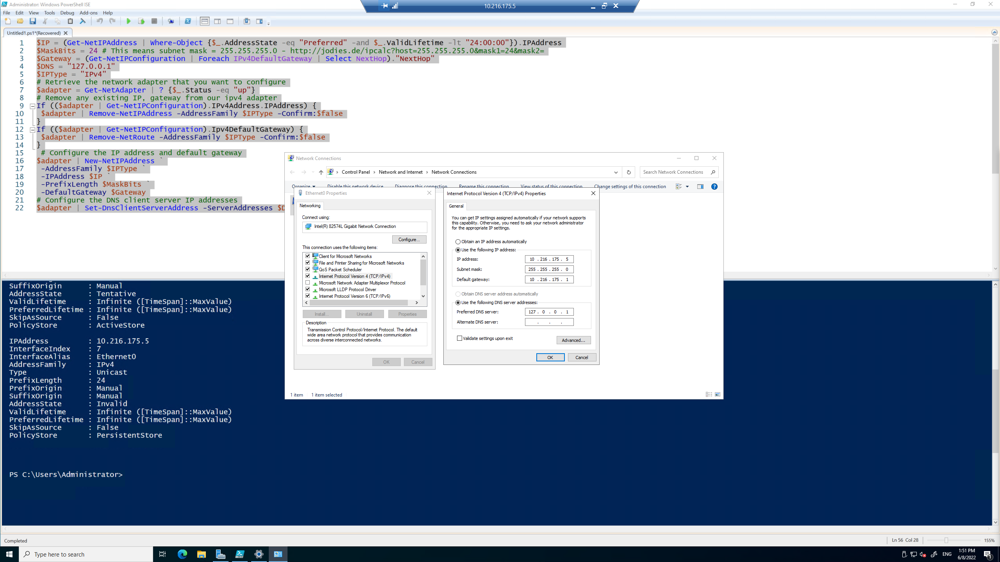
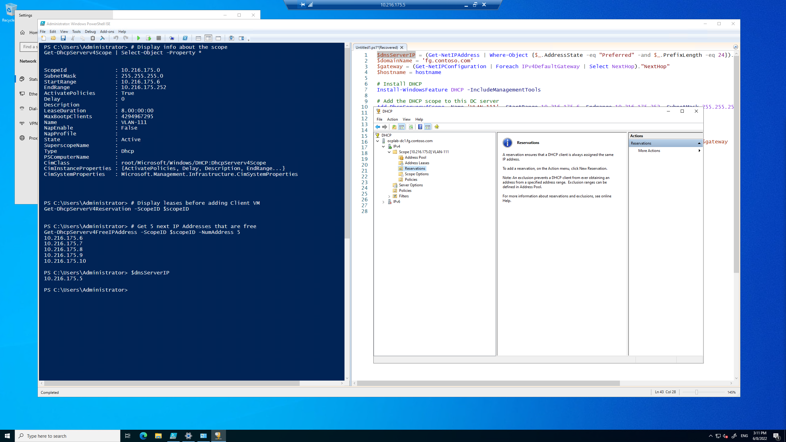

# Openshift vSphere Install
Automated environment for spinning up OCP on VSphere lab

## `govc` notes

```bash
govc version
# govc 0.27.5

govc about
# FullName:     VMware vCenter Server 7.0.3 build-19717403
# Name:         VMware vCenter Server
# Vendor:       VMware, Inc.
# Version:      7.0.3
# ...

govc datacenter.info
# Name:                Your Datacenter
#   Path:              /Your Datacenter
#   Hosts:             4
#   Clusters:          1
#   Virtual Machines:  6
#   Networks:          1
#   Datastores:        1

govc ls
# /Your Datacenter/vm
# /Your Datacenter/network
# /Your Datacenter/host
# /Your Datacenter/datastore

govc find -h
#   a    VirtualApp
#   c    ClusterComputeResource
#   d    Datacenter
#   f    Folder
#   g    DistributedVirtualPortgroup
#   h    HostSystem
#   m    VirtualMachine
#   n    Network
#   o    OpaqueNetwork
#   p    ResourcePool
#   r    ComputeResource
#   s    Datastore
#   w    DistributedVirtualSwitch
# ...

# Store datacenter name
dc=$(govc ls /)
# /Redmond Datacenter

# List all VMs
govc ls /*/vm/*/*/*
# /Redmond Datacenter/vm/DataSvcPG/PG Dev/OCPLab_Templates/OCPLab-WS2022
# /Redmond Datacenter/vm/DataSvcPG/PG Dev/OCPLab_VMs/OCPLab-DEV-1
# /Redmond Datacenter/vm/DataSvcPG/PG Dev/OCPLab_VMs/OCPLab-DC1

# List network
govc ls /*/network
# /Redmond Datacenter/network/DataSvc PG VM Network PG (VLAN 106)

# List ClusterComputeResource
govc ls -t ClusterComputeResource host
# /Redmond Datacenter/host/ArcLab Workload Cluster

# Find templates in a specific folder
template_folder="ArcLab CL Templates"
govc find $dc/vm/$template_folder -type m 

# Get everything back as json
govc object.collect -json 
```

> `#TODO` - automate deployment of DC + DEV1 via Terraform or `govc`, bootstrap scripts and sequence etc

---

## Re-imaging prep

```powershell
# Turn off firewall
Set-NetFirewallProfile -Profile Domain,Public,Private -Enabled False

# Enable remote desktop
Set-ItemProperty -Path 'HKLM:\System\CurrentControlSet\Control\Terminal Server' -name "fDenyTSConnections" -value 0
```
## `OCPLab-DC1`

### Rename machine
```powershell
$vmName = "OCPLab-DC1"
$password = ConvertTo-SecureString 'acntorPRESTO!' -AsPlainText -Force
$localhostAdminUser = New-Object System.Management.Automation.PSCredential ('Administrator', $password)
Rename-Computer -NewName $vmName -LocalCredential $localhostAdminUser -Restart
```

### Set Static IP Address
```powershell
$IP = (Get-NetIPAddress | Where-Object {$_.AddressState -eq "Preferred" -and $_.ValidLifetime -lt "24:00:00"}).IPAddress
$MaskBits = 24 # This means subnet mask = 255.255.255.0 - http://jodies.de/ipcalc?host=255.255.255.0&mask1=24&mask2=
$Gateway = (Get-NetIPConfiguration | Foreach IPv4DefaultGateway | Select NextHop)."NextHop"
$DNS = "127.0.0.1"
$IPType = "IPv4"
# Retrieve the network adapter that you want to configure
$adapter = Get-NetAdapter | ? {$_.Status -eq "up"}
# Remove any existing IP, gateway from our ipv4 adapter
If (($adapter | Get-NetIPConfiguration).IPv4Address.IPAddress) {
 $adapter | Remove-NetIPAddress -AddressFamily $IPType -Confirm:$false
}
If (($adapter | Get-NetIPConfiguration).Ipv4DefaultGateway) {
 $adapter | Remove-NetRoute -AddressFamily $IPType -Confirm:$false
}
 # Configure the IP address and default gateway
$adapter | New-NetIPAddress `
 -AddressFamily $IPType `
 -IPAddress $IP `
 -PrefixLength $MaskBits `
 -DefaultGateway $Gateway
# Configure the DNS client server IP addresses
$adapter | Set-DnsClientServerAddress -ServerAddresses $DNS

# Reconnects RDP
```


### Upgrade to a Domain Controller
```powershell
# Configure the Domain Controller
$domainName = 'fg.contoso.com'
$domainAdminPassword = "acntorPRESTO!"
$secureDomainAdminPassword = $domainAdminPassword | ConvertTo-SecureString -AsPlainText -Force

Install-WindowsFeature -Name AD-Domain-Services -IncludeManagementTools

# Create Active Directory Forest
Install-ADDSForest `
    -DomainName "$domainName" `
    -CreateDnsDelegation:$false `
    -DatabasePath "C:\Windows\NTDS" `
    -DomainMode "7" `
    -DomainNetbiosName $domainName.Split('.')[0].ToUpper() `
    -ForestMode "7" `
    -InstallDns:$true `
    -LogPath "C:\Windows\NTDS" `
    -NoRebootOnCompletion:$false `
    -SysvolPath "C:\Windows\SYSVOL" `
    -Force:$true `
    -SafeModeAdministratorPassword $secureDomainAdminPassword

# Reboots
```

Now we can sign-in as `fg\Administrator` to RDP.

### Install DHCP
```powershell
$dnsServerIP = (Get-NetIPAddress | Where-Object {$_.AddressState -eq "Preferred" -and $_.PrefixLength -eq 24}).IPAddress
$domainName = 'fg.contoso.com'
$gateway = (Get-NetIPConfiguration | Foreach IPv4DefaultGateway | Select NextHop)."NextHop"
$hostname = hostname

# Install DHCP
Install-WindowsFeature DHCP -IncludeManagementTools

# Add the DHCP scope to this DC server
Add-DhcpServerv4Scope -Name 'VLAN-111' -StartRange 10.216.175.6 -Endrange 10.216.175.252 -SubnetMask 255.255.255.0 -State Active

# Observe the ScopeID just created
$scopeID = (Get-DHCPServerV4Scope)[0].ScopeId.IPAddressToString

# Set Options at the Scope level
Set-DhcpServerv4OptionValue -ScopeID $scopeID -DNSServer $dnsServerIP -DNSDomain $domainName -Router $gateway

# Authorize the DHCP server
Add-DhcpServerInDC -DnsName "$hostname.$domainName"

# Display info about the scope
Get-DhcpServerv4Scope | Select-Object -Property *

# Display leases before adding Client VM
Get-DhcpServerV4Reservation -ScopeID $scopeID

# Get 5 next IP Addresses that are free
Get-DhcpServerv4FreeIPAddress -ScopeID $scopeID -NumAddress 5
```

As expected, no leases yet:


## `OCPLab-DEV1`

### Rename machine
```powershell
$vmName = "OCPLab-DEV1"
$password = ConvertTo-SecureString 'acntorPRESTO!' -AsPlainText -Force
$localhostAdminUser = New-Object System.Management.Automation.PSCredential ('Administrator', $password)
Rename-Computer -NewName $vmName -LocalCredential $localhostAdminUser -Restart
```

We reboot the machine through vSphere once.

### Join Domain
```powershell
$user = "FG\Administrator"
$domainAdminPassword = "acntorPRESTO!"
$domainName = 'fg.contoso.com'
$pass = $domainAdminPassword | ConvertTo-SecureString -AsPlainText -Force
$Credential = New-Object -TypeName System.Management.Automation.PSCredential -ArgumentList $user, $pass
add-computer –domainname $domainName -Credential $Credential -restart –force
```

And after the Client VM reboots:


We observe the lease in Domain Controller `OCPLab-DC1` again:
```powershell
Get-DhcpServerV4Reservation
```