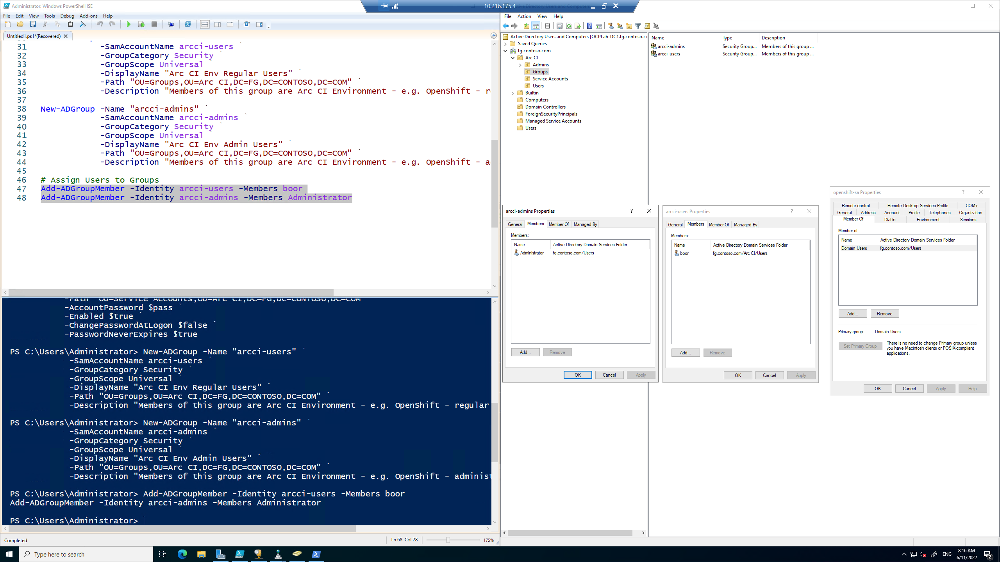
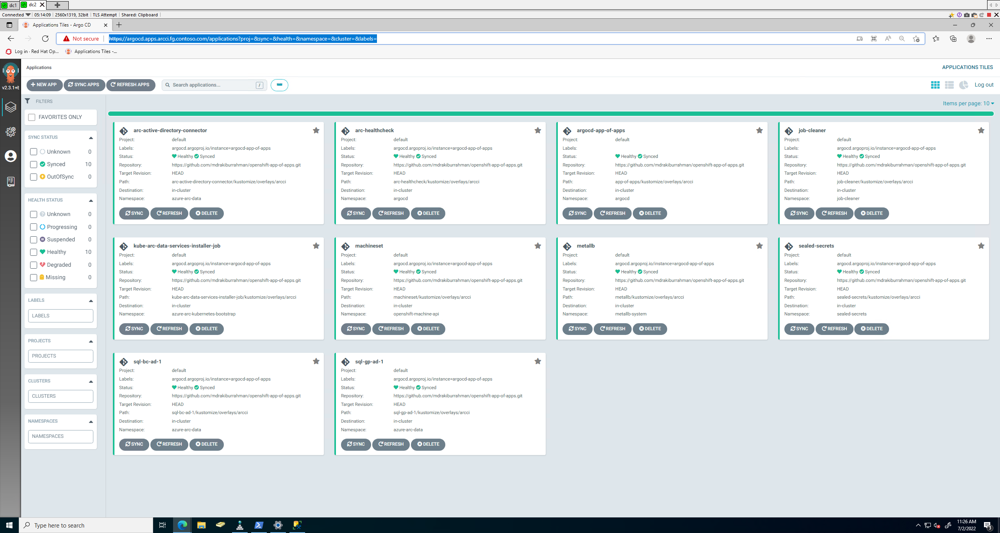
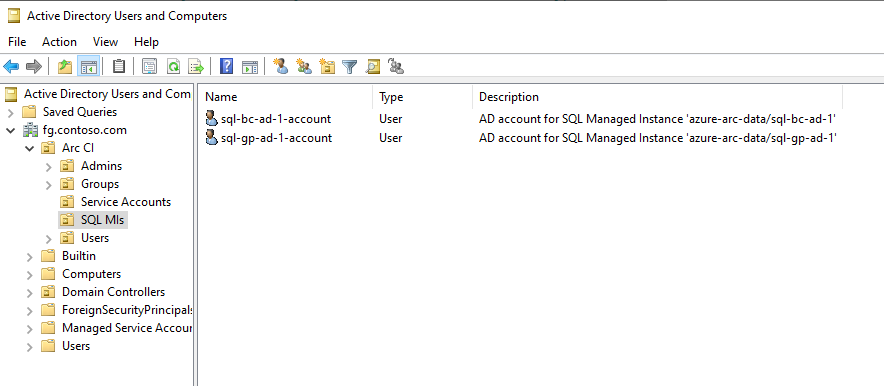

# Openshift vSphere Install
Environment spinup steps for OCP on VSphere lab.

### References:
* The original, more verbose steps for this is available in [this branch](https://github.com/mdrakiburrahman/openshift-vsphere-install/tree/verbose-steps)
* The App of Apps gitops repo for Cluster Onboarding with Arc is in [this repo](https://github.com/mdrakiburrahman/openshift-app-of-apps)

# Domain Controller/DNS/DHCP installation

<details>
  <summary>Re-imaging prep</summary>
  
  ```powershell
  # Turn off firewall
  Set-NetFirewallProfile -Profile Domain,Public,Private -Enabled False

  # Enable remote desktop
  Set-ItemProperty -Path 'HKLM:\System\CurrentControlSet\Control\Terminal Server' -name "fDenyTSConnections" -value 0
  ```

</details>

---

## `ocplab-dc1`

We do a straightforward deploy, no Customizations (we will rename in RDP just for this one):


### Rename machine

Go in through VMRC to Copy-Paste:
```powershell
$vmName = "ocplab-dc1"
$password = ConvertTo-SecureString 'acntorPRESTO!' -AsPlainText -Force
$localhostAdminUser = New-Object System.Management.Automation.PSCredential ('Administrator', $password)
Rename-Computer -NewName $vmName -LocalCredential $localhostAdminUser -Restart
# Reboots
```

### Set Static IP Address

Trigger the script through VMRC so IP address change doesn't drop our RDP:

```powershell
# In case we want to start with a DHCP assigned range
# $IP = (Get-NetIPAddress | Where-Object {$_.AddressState -eq "Preferred" -and $_.ValidLifetime -lt "24:00:00"}).IPAddress

# Start with an IP that we manually test is empty - i.e. ping $IP
$IP = "10.216.175.4"
$MaskBits = 24 # This means subnet mask = 255.255.255.0 - http://jodies.de/ipcalc?host=255.255.255.0&mask1=24&mask2=
$Gateway = (Get-NetIPConfiguration | Foreach IPv4DefaultGateway | Select NextHop)."NextHop"
$DNS = "127.0.0.1"
$IPType = "IPv4"

# Retrieve the network adapter that you want to configure
$adapter = Get-NetAdapter | ? {$_.Status -eq "up"}

# Remove any existing IP, gateway from our ipv4 adapter
If (($adapter | Get-NetIPConfiguration).IPv4Address.IPAddress) {
 $adapter | Remove-NetIPAddress -AddressFamily $IPType -Confirm:$false
}
If (($adapter | Get-NetIPConfiguration).Ipv4DefaultGateway) {
 $adapter | Remove-NetRoute -AddressFamily $IPType -Confirm:$false
}

 # Configure the IP address and default gateway
$adapter | New-NetIPAddress `
 -AddressFamily $IPType `
 -IPAddress $IP `
 -PrefixLength $MaskBits `
 -DefaultGateway $Gateway

# Configure the DNS client server IP addresses
$adapter | Set-DnsClientServerAddress -ServerAddresses $DNS

# Reconnect RDP from Laptop with MSFTVPN - should work at 10.216.175.4
```
For example - we see:


### Upgrade to a Domain Controller

```powershell
# Configure the Domain Controller
$domainName = 'fg.contoso.com'
$domainAdminPassword = "acntorPRESTO!"
$secureDomainAdminPassword = $domainAdminPassword | ConvertTo-SecureString -AsPlainText -Force

Install-WindowsFeature -Name AD-Domain-Services -IncludeManagementTools

# Create Active Directory Forest
Install-ADDSForest `
    -DomainName "$domainName" `
    -CreateDnsDelegation:$false `
    -DatabasePath "C:\Windows\NTDS" `
    -DomainMode "7" `
    -DomainNetbiosName $domainName.Split('.')[0].ToUpper() `
    -ForestMode "7" `
    -InstallDns:$true `
    -LogPath "C:\Windows\NTDS" `
    -NoRebootOnCompletion:$false `
    -SysvolPath "C:\Windows\SYSVOL" `
    -Force:$true `
    -SafeModeAdministratorPassword $secureDomainAdminPassword

# Reboots - takes 2-3 mins at "Please wait for the Group Policy Client" - it's normal for GPO Policy initialization
```

Now we can sign-in as Domain Admin `fg\Administrator` to RDP.

### Install DHCP on the Domain Controller

> * https://adamtheautomator.com/dhcp-scope/

```powershell
$dnsServerIP = (Get-NetIPAddress | Where-Object {$_.AddressState -eq "Preferred" -and $_.PrefixLength -eq 24}).IPAddress
# The 24 filter above is because of our mask we set previously

$domainName = 'fg.contoso.com'
$gateway = (Get-NetIPConfiguration | Foreach IPv4DefaultGateway | Select NextHop)."NextHop"
$hostname = hostname

# Install DHCP
Install-WindowsFeature DHCP -IncludeManagementTools

# Add the DHCP scope to this DC server - from VLAN mapping
# Create an IPv4 DHCP Server Scope
$HashArgs = @{
    'Name' = 'VLAN-111';                    # Redmond VLAN 111 mapping
    'Description' = 'Kubernetes CI Lab ';   # This is the human-readable description of the scope
    'StartRange' = '10.216.175.5';          # Specifies the starting IP address in the scope
    'EndRange' = '10.216.175.254';          # Specifies the end IP address in the scope
    'SubnetMask' = '255.255.255.0';         # Specifies the subnet mask of the scope
    'State' = 'Active';                     # Activates the scope
    'LeaseDuration' = '0.00:30:00';         # Specifies the length of the lease duration - 30 mins
}
Add-DhcpServerv4Scope @HashArgs

# Observe the ScopeID just created
$scopeID = (Get-DHCPServerV4Scope)[0].ScopeId.IPAddressToString

# Set Options at the Scope level
Set-DhcpServerv4OptionValue -ScopeID $scopeID -DNSServer $dnsServerIP -DNSDomain $domainName -Router $gateway

# Authorize the DHCP server
Add-DhcpServerInDC -DnsName "$hostname.$domainName"

# Display info about the scope
Get-DhcpServerv4Scope | Select-Object -Property *

# Display leases before adding other VMs
Get-DhcpServerV4Reservation -ScopeID $scopeID
# Empty

# Add Exclusion ranges

## DC [0 - 5] + OpenShift Routes [6 - 7] + 3 Extras [8 - 10]
Add-DhcpServerv4ExclusionRange -ScopeId $scopeID -StartRange 10.216.175.0 -EndRange 10.216.175.10

## MetalLB
Add-DhcpServerv4ExclusionRange -ScopeId $scopeID -StartRange 10.216.175.48 -EndRange 10.216.175.79

# Get 5 next IP Addresses that are free
Get-DhcpServerv4FreeIPAddress -ScopeID $scopeID -NumAddress 5
# 10.216.175.5        <- DC2
# 10.216.175.11       <- OpenShift nodes
# 10.216.175.12
# 10.216.175.13
# 10.216.175.14
```

When we started - as expected, no leases yet:


Exclusion ranges:


After OpenShift install (post following these steps with `MachineSets`) - all the leases:


### Configure DNS forwarder so we can browse the web

```powershell
# Forward to Redmond DNS
Add-DnsServerForwarder -IPAddress "10.50.10.50"

# Validate
Get-DnsServerForwarder

# Check curl to Google
curl google.com

# Forward queries for arclab.local to ArcLab-DC <-  This must be run on both DC1 and DC2
Add-DnsServerConditionalForwarderZone -Name "arclab.local" -MasterServers "10.216.173.10" # ArcLab-DC.arclab.local
```


## `ocplab-dc2`

Use the vSphere native feature `VM Customization Specifications` to
* Use the vSphere machines name as the hostname
* Generate a new SID
* Auto domain join to `fg.contoso.com`
* Since DHCP is configured above, should get an IP address automatically


The VM will go through it's reboot cycles to join the domain etc.

Post boot in `ocplab-dc2`:


Check leases again in Domain Controller:


Promote `ocplab-dc2` to secondary Domain Controller - we will need to switch to Static IP:
```powershell
# = = = = = = = 
# Set Static IP
# = = = = = = = 

$IP = "10.216.175.5"
$MaskBits = 24 # This means subnet mask = 255.255.255.0 - http://jodies.de/ipcalc?host=255.255.255.0&mask1=24&mask2=
$Gateway = (Get-NetIPConfiguration | Foreach IPv4DefaultGateway | Select NextHop)."NextHop"
$IPType = "IPv4"

# Retrieve the network adapter that you want to configure
$adapter = Get-NetAdapter | ? {$_.Status -eq "up"}

# Remove any existing IP, gateway from our ipv4 adapter
If (($adapter | Get-NetIPConfiguration).IPv4Address.IPAddress) {
 $adapter | Remove-NetIPAddress -AddressFamily $IPType -Confirm:$false
}
If (($adapter | Get-NetIPConfiguration).Ipv4DefaultGateway) {
 $adapter | Remove-NetRoute -AddressFamily $IPType -Confirm:$false
}

 # Configure the IP address and default gateway
$adapter | New-NetIPAddress `
 -AddressFamily $IPType `
 -IPAddress $IP `
 -PrefixLength $MaskBits `
 -DefaultGateway $Gateway

# Configure the DNS client server IP addresses - DC1 and itself
$adapter | Set-DnsClientServerAddress -ServerAddresses ("10.216.175.4","127.0.0.1")

# = = = = = = = 
# Promote to DC
# = = = = = = = 
$domainName = 'fg.contoso.com'
$domainAdminName = "FG\Administrator"
$domainAdminPassword = "acntorPRESTO!"
$secureDomainAdminPassword = $domainAdminPassword | ConvertTo-SecureString -AsPlainText -Force

# Create credential object to pass into -Credential flag
$cred = New-Object -TypeName System.Management.Automation.PSCredential($domainAdminName, $secureDomainAdminPassword)

# Promote to DC in existing domain
Install-WindowsFeature -Name AD-Domain-Services -IncludeManagementTools

Install-ADDSDomainController `
    -DomainName "$domainName" `
    -InstallDns:$true `
    -NoRebootOnCompletion:$false `
    -Credential $cred `
    -SafeModeAdministratorPassword $secureDomainAdminPassword `
    -Force:$true
```


---

# OpenShift `IPI`-based install - Cluster Name: `arcci`

> `IPI` because we want horizontal scalability on our `MachineSets`

## Add a Reverse Lookup Zone on `ocplab-dc1`
```powershell
# Add a reverse lookup zone - VLAN 111
Add-DnsServerPrimaryZone -NetworkId "10.216.175.0/24" -ReplicationScope Domain

# Get reverse zone name
$Zones = @(Get-DnsServerZone)
ForEach ($Zone in $Zones) {
    if ((-not $($Zone.IsAutoCreated)) -and ($Zone.IsReverseLookupZone)) {
       $Reverse = $Zone.ZoneName
    }
}

# Add a PTR record to the Reverse Lookup Zone for the Domain Controller. This is needed for when the SQL MI Pod looks up the DC in reverse.
Add-DNSServerResourceRecordPTR -ZoneName $Reverse -Name 4 -PTRDomainName ocplab-dc1.fg.contoso.com # 4 is because of the IP address of DC1
Add-DNSServerResourceRecordPTR -ZoneName $Reverse -Name 5 -PTRDomainName ocplab-dc2.fg.contoso.com 
```

## DNS records for OpenShift in `ocplab-dc1` - [from here](https://github.com/openshift/installer/blob/master/docs/user/vsphere/vips-dns.md#dns-records)

```PowerShell
$clusterName = 'arcci'
$baseDomain = 'fg.contoso.com'
$ip1 = '10.216.175.6'
$ip2 = '10.216.175.7'

Add-DnsServerResourceRecordA -Name "api.$clusterName" -ZoneName $baseDomain -AllowUpdateAny -IPv4Address $ip1 -TimeToLive 01:00:00 -createptr
Add-DnsServerResourceRecordA -Name "*.apps.$clusterName" -ZoneName $baseDomain -AllowUpdateAny -IPv4Address $ip2 -TimeToLive 01:00:00 -createptr
```

We see:


> We are now ready to deploy OpenShift from our container

---
# `devcontainer` prep

## Validate DNS reverse lookup into fg.contoso.com domain

This devcontainer has a `/etc/resolv.conf` injection script to forward DNS queries to `ocplab-dc1` - this allows us to query all the needed parties below:

```bash
# DNS Tests
nslookup api.arcci.fg.contoso.com
# Address: 10.216.175.6
nslookup console-that-doesnt-exist-yet.apps.arcci.fg.contoso.com
# Address: 10.216.175.7
nslookup quay.io
# Address: 3.227.212.61
nslookup arclab-vc.arclab.local
# Address: 10.216.173.11
nslookup arclab-wl-esxi-02.arclab.local
# Address: 10.216.152.12

# = = = = = = = = = = = = = = = = = = = = = = = = =
# Generate SSH Key pair for Nodes - `DevContainer`
# = = = = = = = = = = = = = = = = = = = = = = = = =
export secretPath='/workspaces/openshift-vsphere-install/openshift-install/secrets'
rm -rf $secretPath
mkdir -p $secretPath/.ssh

# Generate Key Pair
ssh-keygen -t ed25519 -N '' -f $secretPath/.ssh/id_ed25519

# View public key
cat $secretPath/.ssh/id_ed25519.pub
# ssh-ed25519 AAAAC3NzaC...

# Add the SSH private key to `ssh-agent`
eval "$(ssh-agent -s)" # Ensure process is running
# Agent pid 30724

ssh-add $secretPath/.ssh/id_ed25519
# Identity added: /workspaces/openshift-vsphere-install/openshift-install/secrets/.ssh/id_ed25519 ...

# = = = = = = = = = = = = = = = = = = = = = =
# Pulling the OpenShift installation binary
# = = = = = = = = = = = = = = = = = = = = = =
export binaryPath='/workspaces/openshift-vsphere-install/openshift-install/binaries'
rm -rf $binaryPath
mkdir -p $binaryPath
cd $binaryPath

wget https://mirror.openshift.com/pub/openshift-v4/x86_64/clients/ocp/stable/openshift-install-linux.tar.gz
tar -xvf openshift-install-linux.tar.gz
# README.md                 <- useless
# openshift-install         <- useful

mv openshift-install /usr/local/bin/
chmod +x /usr/local/bin/openshift-install
rm README.md

# = = = = = = = = = = = = = = = = = = = = = = = = = 
# Download vCenter root CA Cert into this container
# = = = = = = = = = = = = = = = = = = = = = = = = = 
cd $secretPath
rm -rf certs
wget https://arclab-vc.arclab.local/certs/download.zip --no-check-certificate
unzip download.zip
rm -rf download.zip

# Add certs to Container OS
cp certs/lin/* /usr/local/share/ca-certificates
cp certs/lin/* /etc/ssl/certs
update-ca-certificates --verbose --fresh
# ...
# link Trustwave_Global_Certification_Authority.pem -> f249de83.0
# 127 added, 0 removed; done.
# Running hooks in /etc/ca-certificates/update.d...
# done.
```

> Our devcontainer now has everything it needs to deploy OpenShift

---

## Deploy OCP on vSphere in IPI mode
```bash
export installationDir='/workspaces/openshift-vsphere-install/openshift-install/secrets/arcci'
rm -rf $installationDir
mkdir -p $installationDir
cd $installationDir

# One time - interactively create config file: install-config.yaml
openshift-install create install-config
# ? Platform vsphere
# ? vCenter arclab-vc.arclab.local
# ? Username your-sa@arclab.local
# ? Password [? for help] **********
# INFO Connecting to vCenter arclab-vc.arclab.local 
# INFO Defaulting to only available datacenter: Your Datacenter 
# INFO Defaulting to only available cluster: ArcLab Workload Cluster 
# INFO Defaulting to only available datastore: ArcLab-NFS-01 
# ? Network DataSvc PG OCP VM Network (VLAN 111)
# ? Virtual IP Address for API 10.216.175.6
# ? Virtual IP Address for Ingress 10.216.175.7
# ? Base Domain fg.contoso.com
# ? Cluster Name arcci
# ? Pull Secret [? for help] ********************************
# INFO Install-Config created in: .

tree
# .
# ├── [      13407]  .openshift_install_state.json          # OpenShift install state file
# ├── [       2973]  .openshift_install.log                 # Installer logs
# └── [       3644]  install-config.yaml                    # Reusable config that can be used for reinstalls

# Note that installer below will eat up the YAML file - so we back it up for future.

# Fire install
openshift-install create cluster --log-level=debug
# INFO Consuming Install Config from target directory 
# INFO Obtaining RHCOS image file from 'https://rhcos-redirector.apps.art.xq1c.p1.openshiftapps.com/art/storage/releases/rhcos-4.10/410.84.202205191234-0/x86_64/rhcos-410.84.202205191234-0-vmware.x86_64.ova?sha256=' 
# INFO Creating infrastructure resources...

# ....
# DEBUG Still waiting for the Kubernetes API: Get "https://api.arcci.fg.contoso.com:6443/version": dial tcp 10.216.175.6:6443: connect: connection refused 
# INFO API v1.23.5+3afdacb up                       
# INFO Waiting up to 30m0s (until 4:28AM) for bootstrapping to complete... 
#...
# INFO Waiting up to 10m0s (until 9:13PM) for the openshift-console route to be created... 
# DEBUG Route found in openshift-console namespace: console 
# DEBUG OpenShift console route is admitted          
# INFO Install complete!                            
# INFO To access the cluster as the system:admin user when using 'oc', run 'export KUBECONFIG=/workspaces/openshift-vsphere-install/openshift-install/secrets/arcci/auth/kubeconfig' 
# INFO Access the OpenShift web-console here: https://console-openshift-console.apps.arcci.fg.contoso.com 
# INFO Login to the console with user: "kubeadmin", and password: "..." 
# DEBUG Time elapsed per stage:                      
# DEBUG      pre-bootstrap: 1m18s                    
# DEBUG          bootstrap: 37s                      
# DEBUG             master: 53s                      
# DEBUG Bootstrap Complete: 9m58s                    
# DEBUG                API: 57s                      
# DEBUG  Bootstrap Destroy: 24s                      
# DEBUG  Cluster Operators: 14m22s                   
# INFO Time elapsed: 29m15s  
# 

# Test access
export KUBECONFIG=/workspaces/openshift-vsphere-install/openshift-install/secrets/arcci/auth/kubeconfig

oc get nodes
# NAME                       STATUS   ROLES    AGE   VERSION
# arcci-jlzvv-master-0       Ready    master   40m   v1.23.5+3afdacb
# arcci-jlzvv-master-1       Ready    master   40m   v1.23.5+3afdacb
# arcci-jlzvv-master-2       Ready    master   40m   v1.23.5+3afdacb
# arcci-jlzvv-worker-sfxxl   Ready    worker   40m   v1.23.5+3afdacb
# arcci-jlzvv-worker-wclv7   Ready    worker   38m   v1.23.5+3afdacb
# arcci-jlzvv-worker-zpng2   Ready    worker   40m   v1.23.5+3afdacb
```

Complete:


## Access `oc` and vSphere from `ocplab-dc2`

```PowerShell
# Download oc cli
$chocoPath = "C:\ProgramData\chocolatey\bin"
$ocPath = "https://rakirahman.blob.core.windows.net/public/binaries/oc-4.10.20-windows.zip"
$downloadZip = "oc-4.10.20-windows.zip"

cd $chocoPath
Invoke-WebRequest $ocPath -OutFile "$chocoPath\$downloadZip"
Expand-Archive -Path $downloadZip -DestinationPath $chocoPath
rm README.md
rm $downloadZip

# Download SSMS for later validations
choco install ssms /y -Force
```

## Clean destroy

```bash
openshift-install destroy cluster --dir $installationDir
# INFO Destroyed                                     VirtualMachine=arcci-7p7gn-rhcos
# INFO Destroyed                                     VirtualMachine=arcci-7p7gn-bootstrap
# INFO Destroyed                                     VirtualMachine=arcci-7p7gn-master-2
# INFO Destroyed                                     VirtualMachine=arcci-7p7gn-master-1
# INFO Destroyed                                     VirtualMachine=arcci-7p7gn-master-0
# INFO Destroyed                                     Folder=arcci-7p7gn
# INFO Destroyed                                     Tag=arcci-7p7gn
# INFO Destroyed                                     TagCategory=openshift-arcci-7p7gn
# INFO Time elapsed: 10s 
rm -rf $installationDir
```

---

# Post deploy enhancements

## Ensure master nodes are unschedulable

> Ref: https://access.redhat.com/documentation/en-us/openshift_container_platform/4.2/html/nodes/working-with-nodes#nodes-nodes-working-master-schedulable_nodes-nodes-working

```bash
oc get schedulers cluster -o yaml | yq .spec.mastersSchedulable
# false
```

## LDAP for sign-in

> Ref: 
> * https://docs.openshift.com/container-platform/4.7/authentication/identity_providers/configuring-ldap-identity-provider.html
> * https://youtu.be/RG6xt2q72nw?t=2508
> * https://gist.github.com/acsulli/5acdb1de102b4771553bb9e4b458cb21
> * https://docs.openshift.com/container-platform/4.7/authentication/ldap-syncing.html#ldap-syncing-nesting_ldap-syncing-groups
> * https://github.com/redhat-cop/group-sync-operator

### Disable self-provisioning

> Ref: https://docs.openshift.com/container-platform/4.10/applications/projects/configuring-project-creation.html#disabling-project-self-provisioning_configuring-project-creation

Because stops from random people using up compute.

```bash
# Remove system:authenticated:oauth group from self-provisioners ClusterRoleBinding
oc patch clusterrolebinding.rbac self-provisioners -p '{"subjects": null}'

# Remove auto-update
oc patch clusterrolebinding.rbac self-provisioners -p '{ "metadata": { "annotations": { "rbac.authorization.kubernetes.io/autoupdate": "false" } } }'

# Customize message
cat <<EOF | oc apply -f -
apiVersion: config.openshift.io/v1
kind: Project
metadata:
    name: cluster
spec:
    projectRequestMessage: This cluster is for Arc CI only, you may not create a new Project manually.
EOF
```

### LDAP configuration on `ocplab-dc1`

#### Create AD demo objects
* OU: `Arc CI`
* 2 groups:
    * `arcci-users`
    * `arcci-admins`
* 1 users:
    * `boor` - `arcci-users`
    * `Administrator` (existing) - `arcci-admins`
* 1 sa:
    * `openshift-sa` - for authenticating LDAP users

```powershell
Import-Module ActiveDirectory

# New OUs
New-ADOrganizationalUnit -Name "Arc CI" -Path "DC=FG,DC=CONTOSO,DC=COM"
New-ADOrganizationalUnit -Name "Users" -Path "OU=Arc CI,DC=FG,DC=CONTOSO,DC=COM"
New-ADOrganizationalUnit -Name "Admins" -Path "OU=Arc CI,DC=FG,DC=CONTOSO,DC=COM"
New-ADOrganizationalUnit -Name "Service Accounts" -Path "OU=Arc CI,DC=FG,DC=CONTOSO,DC=COM"
New-ADOrganizationalUnit -Name "Groups" -Path "OU=Arc CI,DC=FG,DC=CONTOSO,DC=COM"

# Create Users/SAs (same thing)
$pass = "acntorPRESTO!" | ConvertTo-SecureString -AsPlainText -Force

New-ADUser -Name "boor" `
           -UserPrincipalName "boor@fg.contoso.com" `
           -Path "OU=Users,OU=Arc CI,DC=FG,DC=CONTOSO,DC=COM" `
           -AccountPassword $pass `
           -Enabled $true `
           -ChangePasswordAtLogon $false `
           -PasswordNeverExpires $true

New-ADUser -Name "openshift-sa" `
           -UserPrincipalName "openshift-sa@fg.contoso.com" `
           -Path "OU=Service Accounts,OU=Arc CI,DC=FG,DC=CONTOSO,DC=COM" `
           -AccountPassword $pass `
           -Enabled $true `
           -ChangePasswordAtLogon $false `
           -PasswordNeverExpires $true

# Create Groups
New-ADGroup -Name "arcci-users" `
            -SamAccountName arcci-users `
            -GroupCategory Security `
            -GroupScope Universal `
            -DisplayName "Arc CI Env Regular Users" `
            -Path "OU=Groups,OU=Arc CI,DC=FG,DC=CONTOSO,DC=COM" `
            -Description "Members of this group are Arc CI Environment - e.g. OpenShift - regular users"

New-ADGroup -Name "arcci-admins" `
            -SamAccountName arcci-admins `
            -GroupCategory Security `
            -GroupScope Universal `
            -DisplayName "Arc CI Env Admin Users" `
            -Path "OU=Groups,OU=Arc CI,DC=FG,DC=CONTOSO,DC=COM" `
            -Description "Members of this group are Arc CI Environment - e.g. OpenShift - administrators"

# Assign Users to Groups
Add-ADGroupMember -Identity arcci-users -Members boor
Add-ADGroupMember -Identity arcci-admins -Members Administrator

# Move my Administrator user to this OU
Get-ADUser -Identity Administrator | Move-ADObject -TargetPath "OU=Users,OU=Arc CI,DC=FG,DC=CONTOSO,DC=COM"
```

We see:


#### Configure OpenShift AuthN

```bash
# Create a secret for the bindDN SA - openshift-sa - password
oc create secret generic ldap-bind-secret \
  --from-literal=bindPassword=acntorPRESTO! \
  -n openshift-config

# Validate bind
ldapsearch -h fg.contoso.com -x -D "CN=openshift-sa,OU=Service Accounts,OU=Arc CI,DC=FG,DC=CONTOSO,DC=COM" -w "acntorPRESTO!" -p 389 -b "DC=FG,DC=CONTOSO,DC=COM" -s sub "sAMAccountName=openshift-sa"
# ref: ldap://fg.contoso.com/CN=Configuration,DC=fg,DC=contoso,DC=com
# search result
# search: 2
# result: 0 Success
# numResponses: 5
# numEntries: 1
# numReferences: 3

# Operator status before apply
oc get co | grep authentication -B 1
# NAME                                       VERSION   AVAILABLE   PROGRESSING   DEGRADED   SINCE   MESSAGE
# authentication                             4.10.16   True        False         False      41h

# Create the OAuth config file, insecure because we don't have a CA
cat <<EOF | oc apply -f -
apiVersion: config.openshift.io/v1
kind: OAuth
metadata:
  name: cluster
spec:
  identityProviders:
    - ldap:
        attributes:
          email:
            - mail
          id:
            - sAMAccountName
          name:
            - cn
          preferredUsername:
            - sAMAccountName
        bindDN: CN=openshift-sa,OU=Service Accounts,OU=Arc CI,DC=FG,DC=CONTOSO,DC=COM
        bindPassword:
          name: ldap-bind-secret
        insecure: true
        url: "ldap://fg.contoso.com/OU=Arc CI,DC=FG,DC=CONTOSO,DC=COM?sAMAccountName?sub?(&(objectClass=user)(|(memberOf:1.2.840.113556.1.4.1941:=CN=arcci-admins,OU=Groups,OU=Arc CI,DC=FG,DC=CONTOSO,DC=COM)(memberOf:1.2.840.113556.1.4.1941:=CN=arcci-users,OU=Groups,OU=Arc CI,DC=FG,DC=CONTOSO,DC=COM)))"
      mappingMethod: claim
      name: fg.contoso.com
      type: LDAP
EOF

# We see
oc get co | grep authentication -B 1
# NAME                                       VERSION   AVAILABLE   PROGRESSING   DEGRADED   SINCE   MESSAGE
# authentication                             4.10.16   True        True          False      41h     OAuthServerDeploymentProgressing: deployment/oauth-openshift.openshift-authentication: 2/3 pods have been updated to the latest generation

# NAME                                       VERSION   AVAILABLE   PROGRESSING   DEGRADED   SINCE   MESSAGE
# authentication                             4.10.16   True        False         False      41h  

# At this point, authentication will work, but not authorization (i.e. our Administrator and other users will have zero permission to anything)
```


#### Configure Group Sync and AuthZ

> Ref:
> * https://gist.github.com/acsulli/5acdb1de102b4771553bb9e4b458cb21#group-sync-cronjob
> * https://examples.openshift.pub/cluster-configuration/authentication/activedirectory-ldap/#deploy-recular-sync-via-cronjobscheduledjob

```bash
# Create temp staging folder
export authZ="/workspaces/openshift-vsphere-install/AuthZ"
rm -rf $authZ
mkdir -p $authZ
cd $authZ

# Create the group sync config file
# the groupUIDNameMapping is added to avoid spaces in the group names
cat << EOF > ldap-sync.yaml
kind: LDAPSyncConfig
apiVersion: v1
url: ldap://fg.contoso.com
bindDN: CN=openshift-sa,OU=Service Accounts,OU=Arc CI,DC=FG,DC=CONTOSO,DC=COM
bindPassword: 'acntorPRESTO!'
insecure: true
groupUIDNameMapping:
  "CN=arcci-users,OU=Groups,OU=Arc CI,DC=FG,DC=CONTOSO,DC=COM": arcci-users
  "CN=arcci-admins,OU=Groups,OU=Arc CI,DC=FG,DC=CONTOSO,DC=COM": arcci-admins
augmentedActiveDirectory:
  groupsQuery:
    derefAliases: never
    pageSize: 0
  groupUIDAttribute: dn
  groupNameAttributes: [ cn ]
  usersQuery:
    baseDN: "OU=Arc CI,DC=FG,DC=CONTOSO,DC=COM"
    scope: sub
    derefAliases: never
    filter: (objectclass=person)
    pageSize: 0
  userNameAttributes: [ sAMAccountName ]
  groupMembershipAttributes: [ "memberOf:1.2.840.113556.1.4.1941:" ]
EOF

# Since we're using nested groups, we'll need an allow list as well
cat << EOF > group-allowlist.txt
CN=arcci-users,OU=Groups,OU=Arc CI,DC=FG,DC=CONTOSO,DC=COM
CN=arcci-admins,OU=Groups,OU=Arc CI,DC=FG,DC=CONTOSO,DC=COM
EOF

# Group Sync CronJob
oc create ns ldap-sync

# Create a Secret with the relevant files - these will get used by our CronJob -> Job -> oc cli pod
oc create secret generic ldap-sync -n ldap-sync \
 --from-file=ldap-sync.yaml=ldap-sync.yaml \
 --from-file=group-allowlist.txt=group-allowlist.txt

# ClusterRole
oc create clusterrole ldap-group-sync \
 --verb=create,update,patch,delete,get,list \
 --resource=groups.user.openshift.io

# Create a Project, ServiceAccount, and ClusterRoleBinding
oc create sa ldap-sync -n ldap-sync
oc adm policy add-cluster-role-to-user ldap-group-sync \
  -z ldap-sync \
  -n ldap-sync

# Create the CronJob
cat << EOF | oc apply -f -
apiVersion: batch/v1
kind: CronJob
metadata:
  name: ldap-group-sync
  namespace: ldap-sync
spec:
  schedule: "*/30 * * * *"
  suspend: false
  jobTemplate:
    spec:
      template:
        spec:
          serviceAccountName: ldap-sync
          restartPolicy: Never
          containers:
            - name: oc-cli
              command:
                - /bin/oc
                - adm
                - groups
                - sync
                - --whitelist=/ldap-sync/group-allowlist.txt
                - --sync-config=/ldap-sync/ldap-sync.yaml
                - --confirm
              image: registry.redhat.io/openshift4/ose-cli
              imagePullPolicy: Always
              volumeMounts:
              - mountPath: /ldap-sync/
                name: config
                readOnly: true
          volumes:
          - name: config
            secret:
              defaultMode: 420
              secretName: ldap-sync
EOF

# This will trigger a job every 30 mins or so - to run it immediately, we run:
oc create job --from=cronjob/ldap-group-sync ldap-group-sync-manual -n ldap-sync

# Validate
oc get groups
# NAME           USERS
# arcci-admins   Administrator
# arcci-users    boor

# Assign RBAC to group
oc adm policy add-cluster-role-to-group cluster-admin arcci-admins
oc adm policy add-cluster-role-to-group cluster-reader arcci-users

# Remove temp folder
rm -rf $authZ
```

We see:

`boor` - read-only:


`Administrator` - read-write:


> Also, note that `boor` cannot read Secrets, or create a terminal session. It can however, read pod logs everywhere - which is exactly what we want.

---

## vSphere CSI

> Ref:
> * https://docs.openshift.com/container-platform/4.10/storage/container_storage_interface/persistent-storage-csi-vsphere.html
> * https://docs.openshift.com/container-platform/4.10/storage/persistent_storage/persistent-storage-vsphere.html
> * (`RWO` looks like) https://docs.openshift.com/container-platform/4.10/storage/understanding-persistent-storage.html#pv-access-modes_understanding-persistent-storage

Looks like we get this for free with IPI. We change the default `storageclass`
```bash
oc patch storageclass thin -p '{"metadata": {"annotations":{"storageclass.kubernetes.io/is-default-class":"false"}}}'
oc patch storageclass thin-csi -p '{"metadata": {"annotations":{"storageclass.kubernetes.io/is-default-class":"true"}}}'
# NAME                 PROVISIONER                    RECLAIMPOLICY   VOLUMEBINDINGMODE      ALLOWVOLUMEEXPANSION   AGE
# thin                 kubernetes.io/vsphere-volume   Delete          Immediate              false                  2d2h
# thin-csi (default)   csi.vsphere.vmware.com         Delete          WaitForFirstConsumer   true                   2d2h
```

Let's test it:
```bash
cat << EOF | oc apply -f -
apiVersion: v1
kind: Namespace
metadata:
  name: vspherecsitest
---
apiVersion: "v1"
kind: PersistentVolumeClaim
metadata:
  name: claim1
  namespace: vspherecsitest
spec:
  accessModes:
    - ReadWriteOnce
  resources:
    requests:
      storage: 1Gi 
  storageClassName: thin-csi
---
apiVersion: v1
kind: Pod
metadata:
  name: nginx
  namespace: vspherecsitest
spec:
  containers:
  - name: task-pv-container
    image: nginx
    ports:
      - containerPort: 80
        name: "http-server"
    volumeMounts:
    - mountPath: "/data" 
      name: vsphere-csi-vol
  volumes:
    - name: vsphere-csi-vol
      persistentVolumeClaim:
        claimName: claim1 
EOF

# Create a couple files in the Pod
oc exec -it nginx -n vspherecsitest -- /bin/sh
# 
touch /data/myfile.txt
apt-get update && apt-get install -y wget
wget https://github.com/Microsoft/sql-server-samples/releases/download/adventureworks/AdventureWorks2019.bak -O /data/AdventureWorks2019.bak

cd data
ls -lR
# total 212104 # 212 MB
# -rw-rw-rw-. 1 root root 217178112 Dec  8  2021 AdventureWorks2019.bak
# drwx------. 2 root root     16384 Jun 26 10:57 lost+found
# -rw-rw-rw-. 1 root root         0 Jun 26 10:59 myfile.txt
```

Before downloading large file:


After:


Remove the namespace:
```bash
oc delete ns vspherecsitest
```

---

## New `MachineSet`

This is done via GitOps [here](https://github.com/mdrakiburrahman/openshift-app-of-apps/blob/main/machineset/kustomize/base/configure-machineset.yaml).

We see the VMs getting created:


And we see events per machine:


---

## `RWX` via Azure

Create `ClusterRole` for Secret Read/Write and add to `ServiceAccount` that binds PVCs:

```bash
cat << EOF | oc apply -f -
apiVersion: rbac.authorization.k8s.io/v1
kind: ClusterRole
metadata:
  name: system:azure-cloud-provider
rules:
- apiGroups: ['']
  resources: ['secrets']
  verbs:     ['get','create']
EOF
# clusterrole.rbac.authorization.k8s.io/system:azure-cloud-provider created

# Bind ClusterRole to ServiceAccount
oc adm policy add-cluster-role-to-user system:azure-cloud-provider system:serviceaccount:kube-system:persistent-volume-binder
# clusterrole.rbac.authorization.k8s.io/system:azure-cloud-provider added: "system:serviceaccount:kube-system:persistent-volume-binder"
```

### Testing Static provisioning

#### Provision via Terraform

Create Storage Account, `StorageClass` and 25 `RWX` `PVs`/Shares via Terraform:

```bash
# ---------------------
# ENVIRONMENT VARIABLES
# For Terraform
# ---------------------
# OCP
export kube_context="kubectl config view --minify --flatten --context=admin"
export infra_id=$(oc get -o jsonpath='{.status.infrastructureName}{"\n"}' infrastructure cluster)

export TF_VAR_host=$(eval "$kube_context" | yq .clusters[0].cluster.server)
export TF_VAR_client_certificate=$(eval "$kube_context" | yq .users[0].user.client-certificate-data)
export TF_VAR_client_key=$(eval "$kube_context" | yq .users[0].user.client-key-data)
export TF_VAR_cluster_ca_certificate=$(eval "$kube_context" | yq .clusters[0].cluster.certificate-authority-data)

# Azure
export TF_VAR_SPN_CLIENT_ID=$spnClientId
export TF_VAR_SPN_CLIENT_SECRET=$spnClientSecret
export TF_VAR_SPN_TENANT_ID=$spnTenantId
export TF_VAR_SPN_SUBSCRIPTION_ID=$subscriptionId
export TF_VAR_prefix="${infra_id}"
export TF_VAR_pvshare_size=10 # GB
export TF_VAR_pvshare_prefix="fls-"
export TF_VAR_pvshare_nums=25

# Remote State in Azure Blob
export stateFileKeyName="openshift-vsphere-install/${infra_id}/terraform.tfstate"

export TF_CLI_ARGS_init="-backend-config='storage_account_name=${TFSTATE_STORAGE_ACCOUNT_NAME}'"
export TF_CLI_ARGS_init="$TF_CLI_ARGS_init -backend-config='container_name=${TFSTATE_STORAGE_ACCOUNT_CONTAINER_NAME}'"
export TF_CLI_ARGS_init="$TF_CLI_ARGS_init -backend-config='access_key=${TFSTATE_STORAGE_ACCOUNT_KEY}'"
export TF_CLI_ARGS_init="$TF_CLI_ARGS_init -backend-config='key=${stateFileKeyName}'"

# ---------------------
# DEPLOY TERRAFORM
# ---------------------
cd /workspaces/openshift-vsphere-install/terraform

terraform init

terraform plan

# Plan: 55 to add, 0 to change, 0 to destroy.

terraform apply -auto-approve

# Apply complete! Resources: 55 added, 0 changed, 0 destroyed.

# Outputs:

# storage_account_name = "arcciwcgvjsa8d9a8680"
# storage_class_name = "azure-file"
# storage_class_secret_name = "azure-file-arcciwcgvjsa8d9a8680-csi-driver-secret"
# storage_class_secret_namespace = "openshift-cluster-csi-drivers"

# We will dynamically bind to the PVs created as PVCs are requested - so we don't need the info above, other than storage_class_name

export storageAccountName=$(terraform output --raw storage_account_name)
export storageClassName=$(terraform output --raw storage_class_name)

```

We see the provisioned infra:


### Test

Deploy Test Pod with `azure-file`, `RWX` PVC:

```bash
cat << EOF | oc apply -f -
apiVersion: v1
kind: Namespace
metadata:
  name: azfiletest
---
apiVersion: v1
kind: PersistentVolumeClaim
metadata:
  name: claim1
  namespace: azfiletest
spec:
  accessModes:
    - ReadWriteMany
  resources:
    requests:
      storage: 10Gi
  storageClassName: $storageClassName
---
apiVersion: v1
kind: Pod
metadata:
  name: nginx
  namespace: azfiletest
spec:
  containers:
  - name: task-pv-container
    image: nginx
    ports:
      - containerPort: 80
        name: "http-server"
    volumeMounts:
    - mountPath: "/data" 
      name: azure-file-share
  volumes:
    - name: azure-file-share
      persistentVolumeClaim:
        claimName: claim1 
EOF

oc exec -it nginx -n azfiletest -- /bin/sh
# 
touch /data/myfile.txt
```

And we see our file in the file share, with one of the random PVs being bound:


> The advantage of Terraform here is, if we need more `RWX` volumes, we can just increment the number and reapply terraform.

#### Cleanup and reconcile

> * https://stackoverflow.com/questions/50667437/what-to-do-with-released-persistent-volume

Let's blow away the PVC and namespace and see how we can reclaim the PV:

```bash
oc delete ns azfiletest
```

So that deletes the `PVC`, but the `PV` and actual file is stil there:


So if we don't care about the data in the "PVShare", we just delete it from ARM/K8s, and run Terraform again to reprovision:

> If we do care about keeping the data, there's great [steps here](https://stackoverflow.com/a/59406641/8954538)

```bash
export pvshare_name="fls-9"

# Delete from K8s
oc delete pv $pvshare_name

# Delete from ARM
az login --service-principal --username $spnClientId --password $spnClientSecret --tenant $spnTenantId
az account set --subscription $subscriptionId

az storage share delete --name $pvshare_name \
                        --account-name $storageAccountName
# ...
# {
#   "deleted": true
# }

# Reconcile gap - 1 PV + 1 Share - via Terraform
terraform plan
# Plan: 2 to add, 0 to change, 0 to destroy.

terraform apply -auto-approve
```

Good as new!


---

## ArgoCD - base

> * https://computingforgeeks.com/how-to-install-argocd-on-openshift-cluster/

```bash
# Argo namespace
kubectl create namespace argocd

# Apply massive YAML in Argo Namespace
kubectl apply -n argocd -f /workspaces/openshift-vsphere-install/ArgoCD/install/argo.yaml

# Creates route to access UI
cat << EOF | oc apply -f -
apiVersion: route.openshift.io/v1
kind: Route
metadata:
  name: argocd-route
  namespace: argocd
spec:
  host: argocd.apps.arcci.fg.contoso.com
  port:
    targetPort: http
  tls:
    termination: passthrough 
    insecureEdgeTerminationPolicy: None 
  to:
    kind: Service
    name: argocd-server
    weight: 100
  wildcardPolicy: None
EOF
# route.route.openshift.io/argocd-route created
```

ArgoCD is now accessible:


Login to `argocd` CLI:
```bash
# Change Argo password secret to "password" and change time of patch to now
kubectl -n argocd patch secret argocd-secret \
  -p '{"stringData": {
    "admin.password": "$2a$10$rRyBsGSHK6.uc8fntPwVIuLVHgsAhAX7TcdrqW/RADU0uh7CaChLa",
    "admin.passwordMtime": "'$(date +%FT%T%Z)'"
  }}'

# Access via CLI
argocd login argocd.apps.arcci.fg.contoso.com --username admin --password 'password' --insecure

# List apps
argocd app list
# NAME  CLUSTER  NAMESPACE  PROJECT  STATUS  HEALTH  SYNCPOLICY  CONDITIONS  REPO  PATH  TARGET

# Empty for now
```

## ArgoCD - App of App

App-of-apps will create literally everything up untill MIAA in Git - so we need to perform all the necessary pre-reqs before we deploy it.

### Pre-reqs

#### ArgoCD `configMap`

Repeated delete testing causes the `argocd-cm` to get deleted since we use it in our healthchecks. First, check `oc get configmap argocd-cm -n argocd`.

If it's not there, run:

```bash
kubectl apply -n argocd -f /workspaces/openshift-vsphere-install/ArgoCD/install/argo.yaml
```

#### Sealed Secret

Inject BYOK for Sealed Secrets - this will get wiped after App of App delete:

```bash
export NAMESPACE="sealed-secrets"
kubectl create namespace "$NAMESPACE"
kubectl apply -f /workspaces/openshift-vsphere-install/.devcontainer/.keys/sealed-secrets-secret.yaml
```

#### `kube-arc-data-services-installer-job`

##### Secret

Make sure the Encrypted Secret for the job is committed in git, e.g. [here](https://github.com/mdrakiburrahman/openshift-app-of-apps/blob/main/kube-arc-data-services-installer-job/kustomize/overlays/arcci/configs/azure-spn-secret.yaml)

##### Onboard intention

Make sure `DELETE_FLAG=false` in the ConfigMap, e.g. [here](https://github.com/mdrakiburrahman/openshift-app-of-apps/blob/74d372db114e02c2d57264b79281f731d3e17e84/kube-arc-data-services-installer-job/kustomize/overlays/arcci/configs/configMap.env#L1)

#### Arc `ADC` connector

One-time activity for Windows Service Account generation - perform the following on the Domain Controller `ocplab-dc1`:

```powershell
Import-Module ActiveDirectory

# New OU for all MIAAs
New-ADOrganizationalUnit -Name "SQL MIs" -Path "OU=Arc CI,DC=fg,DC=contoso,DC=com"

# Create Domain Service Account for ADC in SA OU
$pass = "acntorPRESTO!" | ConvertTo-SecureString -AsPlainText -Force

New-ADUser -Name "arcadc-sa" `
           -UserPrincipalName "arcadc-sa@fg.contoso.com" `
           -Path "OU=Service Accounts,OU=Arc CI,DC=fg,DC=contoso,DC=com" `
           -AccountPassword $pass `
           -Enabled $true `
           -ChangePasswordAtLogon $false `
           -PasswordNeverExpires $true

# Provide minimum access in MIAA OU for Service Account

# Localize our SQL MI OU and Service Account
$Ou = "OU=SQL MIs,OU=Arc CI,DC=fg,DC=contoso,DC=com"
$DsaName = "arcadc-sa"

# Use the AD Drive - a special Drive "AD:\>"
# See here: https://devblogs.microsoft.com/scripting/playing-with-the-ad-drive-for-fun-and-profit/
Set-Location AD:

# Grab our Service Accounts unique Identity - the SID, then cast it to an IdentityReference
$DsaObj = Get-ADuser -Identity $DsaName
$DsaObjSID = [System.Security.Principal.SecurityIdentifier] $DsaObj.SID
$DsaIdentity = [System.Security.Principal.IdentityReference] $DsaObjSID

# Grab ACLs on the existing OU, we're going to append the required permissions to it
$ACL = Get-Acl -Path $Ou

# Active Directory has a specific set of unique GUIDs per permission object. 
# For example, for Reset Password, the GUID is: 00299570-246d-11d0-a768-00aa006e0529
# This is documented here: https://docs.microsoft.com/en-us/windows/win32/adschema/r-user-force-change-password
$All = [GUID]"00000000-0000-0000-0000-000000000000"
$Users = [GUID]"bf967aba-0de6-11d0-a285-00aa003049e2"
$ResetPassword = [GUID]"00299570-246d-11d0-a768-00aa006e0529"

# Reference these GUIDs to create rule objects

# 1. Read all properties in OU
$Rule1 = New-Object System.DirectoryServices.ActiveDirectoryAccessRule(    
                                                                        $DsaIdentity,
                                                                        [System.DirectoryServices.ActiveDirectoryRights]::ReadProperty,
                                                                        [System.Security.AccessControl.AccessControlType]::Allow,
                                                                        $All,
                                                                        [DirectoryServices.ActiveDirectorySecurityInheritance]::All,
                                                                        $All
                                                                      )
# 2. Write all properties in OU
$Rule2 = New-Object System.DirectoryServices.ActiveDirectoryAccessRule(    
                                                                        $DsaIdentity,
                                                                        [System.DirectoryServices.ActiveDirectoryRights]::WriteProperty,
                                                                        [System.Security.AccessControl.AccessControlType]::Allow,
                                                                        $All,
                                                                        [DirectoryServices.ActiveDirectorySecurityInheritance]::All,
                                                                        $All
                                                                      )

# 3. Create User objects in OU
$Rule3 = New-Object System.DirectoryServices.ActiveDirectoryAccessRule(    
                                                                        $DsaIdentity,
                                                                        [System.DirectoryServices.ActiveDirectoryRights]::CreateChild,
                                                                        [System.Security.AccessControl.AccessControlType]::Allow,
                                                                        $Users,
                                                                        [DirectoryServices.ActiveDirectorySecurityInheritance]::All
                                                                      )
# 4. Delete User objects in OU
$Rule4 = New-Object System.DirectoryServices.ActiveDirectoryAccessRule(    
                                                                        $DsaIdentity,
                                                                        [System.DirectoryServices.ActiveDirectoryRights]::DeleteChild,
                                                                        [System.Security.AccessControl.AccessControlType]::Allow,
                                                                        $Users,
                                                                        [DirectoryServices.ActiveDirectorySecurityInheritance]::All
                                                                      )

# 5. Reset Password for Descendant User objects
$Rule5 = New-Object System.DirectoryServices.ActiveDirectoryAccessRule(    
                                                                        $DsaIdentity,
                                                                        [System.DirectoryServices.ActiveDirectoryRights]::ExtendedRight,
                                                                        [System.Security.AccessControl.AccessControlType]::Allow,
                                                                        $ResetPassword,
                                                                        [DirectoryServices.ActiveDirectorySecurityInheritance]::Descendents,
                                                                        $Users
                                                                      )

# Add these new rules to the existing ACL
$ACL.AddAccessRule($Rule1)
$ACL.AddAccessRule($Rule2)
$ACL.AddAccessRule($Rule3)
$ACL.AddAccessRule($Rule4)
$ACL.AddAccessRule($Rule5)

# Commit
Set-Acl -Path $Ou -AclObject $ACL

# Get all permissions in our OU
$permissions = (Get-ACL "AD:$((Get-ADOrganizationalUnit -Identity $Ou).distinguishedname)").access

# Filter permissions.IdentityReference for "FG\arcadc-sa"
$permissions | Where-Object { $_.IdentityReference -eq "FG\$DsaName" }

# Desired output:

# ActiveDirectoryRights : ReadProperty, WriteProperty
# InheritanceType       : All
# ObjectType            : 00000000-0000-0000-0000-000000000000
# InheritedObjectType   : 00000000-0000-0000-0000-000000000000
# ObjectFlags           : None
# AccessControlType     : Allow
# IdentityReference     : FG\arcadc-sa
# IsInherited           : False
# InheritanceFlags      : ContainerInherit
# PropagationFlags      : None

# ActiveDirectoryRights : CreateChild, DeleteChild
# InheritanceType       : All
# ObjectType            : bf967aba-0de6-11d0-a285-00aa003049e2
# InheritedObjectType   : 00000000-0000-0000-0000-000000000000
# ObjectFlags           : ObjectAceTypePresent
# AccessControlType     : Allow
# IdentityReference     : FG\arcadc-sa
# IsInherited           : False
# InheritanceFlags      : ContainerInherit
# PropagationFlags      : None

# ActiveDirectoryRights : ExtendedRight
# InheritanceType       : Descendents
# ObjectType            : 00299570-246d-11d0-a768-00aa006e0529
# InheritedObjectType   : bf967aba-0de6-11d0-a285-00aa003049e2
# ObjectFlags           : ObjectAceTypePresent, InheritedObjectAceTypePresent
# AccessControlType     : Allow
# IdentityReference     : FG\arcadc-sa
# IsInherited           : False
# InheritanceFlags      : ContainerInherit
# PropagationFlags      : InheritOnly
```

We see in the UI:


Note: to delete the OU and recreate (if necessary to repeat the process):
```powershell
Get-ADOrganizationalUnit -Identity $Ou |
    Set-ADObject -ProtectedFromAccidentalDeletion:$false -PassThru |
    Remove-ADOrganizationalUnit -Confirm:$false
```

### Onboard to App of App

```bash
cat << EOF | oc apply -f -
apiVersion: argoproj.io/v1alpha1
kind: Application
metadata:
  name: argocd-app-of-apps
  namespace: argocd
spec:
  project: default
  source:
    repoURL: 'https://github.com/mdrakiburrahman/openshift-app-of-apps.git'
    path: app-of-apps/kustomize/overlays/arcci
    targetRevision: HEAD
  destination:
    server: https://kubernetes.default.svc
    namespace: argocd
  syncPolicy:
    automated:
      prune: true
      selfHeal: true
    syncOptions:
      - Validate=false
      - CreateNamespace=false
EOF
```

We see our App of apps get rolled out with each stage of the healthcheck till the end:



---

# Post-deployment manual steps

> Candidates for further automation, e.g. [`external-dns`](https://github.com/kubernetes-sigs/external-dns/issues/2416#issuecomment-1152921323)

## MIAA - DNS entry

Grab IP address allocated to MIAA `LoadBalancer` externally:
```bash
# GP and BC Primary
miaa_name='sql-gp-ad-1' #'sql-bc-ad-1'
miaa_svcs=$(oc get svc -l=app.kubernetes.io/instance=${miaa_name} -n azure-arc-data -o=json)
miaa_external_svc=$(echo $miaa_svcs | jq -r '.items[] | select(.spec.type == "LoadBalancer")')
miaa_external_svc_ip=$(echo $miaa_external_svc | jq -r '.status.loadBalancer.ingress[0].ip')
echo $miaa_external_svc_ip
# 10.216.175.48 <- GP
# 10.216.175.49 10.216.175.50 <- BC

# BC Secondary
miaa_name='sql-bc-ad-1'
kubectl get sqlmi ${miaa_name} -n azure-arc-data -o json | jq -r .status.endpoints.secondary
# 10.216.175.50,1433 <- BC Secondary
```

Add in DNS entry for the K8s service:
```powershell
Add-DnsServerResourceRecordA -Name sql-gp-ad-1 -ZoneName fg.contoso.com -IPv4Address 10.216.175.48
Add-DnsServerResourceRecordA -Name sql-bc-ad-1 -ZoneName fg.contoso.com -IPv4Address 10.216.175.49
```

Login via SQL Admin creds to `sql-gp-ad-1.fg.contoso.com,31433` and `sql-gp-bc-1.fg.contoso.com,31433`, 

Add in AD Groups as SQL Admin to MIAA:
```sql
USE [master]
GO
CREATE LOGIN [FG\arcci-admins] FROM WINDOWS WITH DEFAULT_DATABASE=[master]
GO
ALTER SERVER ROLE [sysadmin] ADD MEMBER [FG\arcci-admins]
GO
```

> At this time it looks like the Secondary Endpoint doesn't support AD Auth in ADC SMK mode (probably because the SPN's weren't registered)


Validate login via AD creds from Client VM `ocplab-dc2` via DNS entry `sql-gp-ad-1.fg.contoso.com,31433`:


And we see that the Controller has been managing the AD Account Creation/Keytab distribution on our behalf:



---

## Integrate OCP with Azure DevOps

### Create Build Agent in vSphere

We have an Ubuntu 20.04 vanilla template image, and a `VM Customization Specifications` that onboards the Machine to our `ocplab-dc1` DNS Server/DHCP:


We create a VM from this Template called `ocplab-AGENT1`:


The VM will come up, and automatically contact the DHCP server to grab the next available IP:


We connect to the VM with PuTTY (for pasting commands), and validate DNS resolution:


### Connect build agent to Azure DevOps Org

We use a demo Azure DevOps Org and create a new Agent Pool:


We create a PAT token with the following permissions:


And use the following script to onboard the machine as a Self Hosted runner:

```bash
# Localize
export ORG="https://dev.azure.com/ohdevopsraki"
export TOKEN="h45..."
export POOL="vsphere_lab"
export SUDO_PASSWORD="acntorPRESTO!"

# Install pre-reqs
echo $SUDO_PASSWORD | sudo -S apt install jq  -y

# Source the helpers for use with the script
wget https://gist.githubusercontent.com/mdrakiburrahman/118479e70112a2845fd6ac3592682048/raw/ada70f966cca665d9006d90605b6e8fe7fb5dbb0/install.sh
source install.sh

# Download and untar VSTS Agent
VSTS_ASSETS_URL=$(curl -s https://api.github.com/repos/microsoft/azure-pipelines-agent/releases/latest | jq -r '.assets[].browser_download_url')
download_with_retries $VSTS_ASSETS_URL "/tmp"
URL=$(cat /tmp/assets.json | jq -r '.[] | select((.name | startswith("vsts-agent-linux")) and .platform == "linux-x64") | .downloadUrl')
download_with_retries $URL "/tmp"
mkdir agent
tar -xzf /tmp/vsts-agent-linux-*.tar.gz --directory agent

# Install in unattended mode
agent/config.sh --unattended --acceptteeeula --url $ORG --auth PAT --token $TOKEN --pool $POOL --agent $HOSTNAME

# Run agent in systemd mode so we don't mess around with interactive prompts, this svc.sh file is generated after the install above
cd agent
sudo ./svc.sh install
echo $SUDO_PASSWORD | sudo -S ./svc.sh start
```


### Create K8s Service Account for AzDO pipeline

```bash
# Create a new service account
kubectl create sa azdo-sa -n default
# serviceaccount/azdo-sa created

# Assign service account cluster-admin for demo
kubectl create clusterrolebinding azdo-cluster-admin-binding --clusterrole=cluster-admin --serviceaccount=default:azdo-sa
# clusterrolebinding.rbac.authorization.k8s.io/azdo-cluster-admin-binding created

# Get the first secret, which is the API Server secret for OpenShift
# https://cookbook.openshift.org/accessing-an-openshift-cluster/how-can-i-create-a-service-account-for-scripted-access.html
export SECRET=$(kubectl get serviceAccounts azdo-sa -n default -o=jsonpath={.secrets[1].name})

kubectl get secret ${SECRET} -n default -o json > azdo-sa.json
# Ensure the secret is of type "type": "kubernetes.io/service-account-token" and not the OpenShift Docker one! Can improve the query above to validate this rather than hardcoding 0 or 1
```


Create a Service Connection in Azure DevOps for K8s with the APIServer URL as `https://api.arcci.fg.contoso.com:6443`:

```bash
kubectl config view --minify -o jsonpath={.clusters[0].cluster.server}
# https://api.arcci.fg.contoso.com:6443
```


### Deploy a SQL MI from Azure DevOps

We create a new repo, with the following SQL MI manifest `sql-gp-ad-2.yaml`:

```yaml
apiVersion: v1
data:
  password: YWNudG9yUFJFU1RPIQ==
  username: Ym9vcg==
kind: Secret
metadata:
  annotations:
    argocd.argoproj.io/sync-wave: "1"
  name: sql-gp-ad-2-secret
  namespace: azure-arc-data
type: Opaque
---
apiVersion: sql.arcdata.microsoft.com/v5
kind: SqlManagedInstance
metadata:
  annotations:
    argocd.argoproj.io/sync-wave: "2"
  name: sql-gp-ad-2
  namespace: azure-arc-data
spec:
  backup:
    retentionPeriodInDays: 7
  dev: true
  forceHA: "true"
  licenseType: LicenseIncluded
  replicas: 1
  scheduling:
    default:
      resources:
        limits:
          cpu: "2"
          memory: 4Gi
        requests:
          cpu: "1"
          memory: 2Gi
  security:
    activeDirectory:
      accountName: sql-gp-ad-2-account
      connector:
        name: adarc
    adminLoginSecret: sql-gp-ad-2-secret
  services:
    primary:
      dnsName: sql-gp-ad-2.fg.contoso.com
      port: 31433
      type: LoadBalancer
  settings:
    network:
      forceencryption: "0"
      tlsprotocols: "1.2"
    sqlagent:
      enabled: "true"
  storage:
    data:
      volumes:
      - className: thin-csi
        size: 5Gi
    datalogs:
      volumes:
      - className: thin-csi
        size: 5Gi
    logs:
      volumes:
      - className: thin-csi
        size: 5Gi
  tier: GeneralPurpose
```

And a simple Release Pipeline that runs on our self-hosted agent `deploy.yaml`:
```yaml
pool: vsphere_lab

steps:
- script: echo "Deploying to OpenShift from manifest on Azure"
  displayName: 'Start deployment'

- task: KubernetesManifest@0
  inputs:
    action: 'deploy'
    kubernetesServiceConnection: 'vSphere OpenShift'
    namespace: 'azure-arc-data'
    manifests: 'kubernetes/sql-gp-ad-2.yaml'
```


Create a new Release Pipeline from the above YAML and run it:


Note that the manifest task auto annotates the deployment:

```bash
/home/boor/agent/_work/_tool/kubectl/1.24.2/x64/kubectl annotate -f /home/boor/agent/_work/_temp/Secret_sql-gp-ad-2-secret_1656545337157,/home/boor/agent/_work/_temp/SqlManagedInstance_sql-gp-ad-2_1656545337157 azure-pipelines/run=20220629.2 azure-pipelines/pipeline="testopenshift" azure-pipelines/pipelineId="14" azure-pipelines/jobName="Job" azure-pipelines/runuri=https://dev.azure.com/ohdevopsraki/devopsoh15219/_build/results?buildId=117 azure-pipelines/project=devopsoh15219 azure-pipelines/org=https://dev.azure.com/ohdevopsraki/ --overwrite --namespace azure-arc-data
```

And we see the Pods coming up, and the Controller doing the deploy:


> This is definitely not as elegant as the GitOps route but should work for quick scripted validations

---

## TO-DOs

### Main
- [X] Make master nodes unschedulable
- [X] Disable self provisioning
- [X] LDAP for sign-in
  - [X] Create an AD Group script for Cluster-Admins, add people
  - [X] AuthZ and Group Sync
- [X] VMWare CSI for StorageClass
- [X] Onboard Arc via a `job`
  - [X] Make all the `scc` stuff for Arc pre-req an Argo repo
  - [X] Make the onboarder _agnostic_ for AKS and OCP - just `kustomize`
- [X] `RWX` StorageClass (Azure File CSI?) - **Static Only on OpenShift**
- [X] ArgoCD AoA - subpath in same repo? Different repo?
  - [X] MachineSet
  - [X] Add in MetalLB Operator for `LoadBalancer`
  - [X] Bitnami Sealed Secrets
  - [X] Job onboarder test
  - [X] MIAA manifests as another App in the last wave
- [X] Integrate a basic deploy with Azure DevOps Build Agent that can `kubectl apply` MIAA to OCP
- [X] Rerun through steps, ensure everything is reproducible, specially the OpenShift deploy and ArgoCD waves
- [X] `Job` Arc onboarder
  - [X] OpenShift offboarding is not idempotent, route deletion causes Pod to fail
  - [X] Remove hacky workaround for onboarder `Job` that's present for Argo health check
- [ ] Wrap OpenShift deploy up until ArgoCD onboarding into a script

### Networking
- [X] Deal with DHCP with extreme dilligence! Ensure the ingress routes for OpenShift cannot be assigned to VMs (Windows or RHOS). This means I should carve out a chunk for multiple OpenShift clusters
- [X] Plan out your IP address ranges - figure out MetalLB if it sucks up IPs - if so, plan out CIDRs
- [X] Can I use another VLAN outside of `VLAN-111`?
    > Not via IPI: [Link](https://cloud.redhat.com/blog/how-to-install-openshift-on-vmware-with-terraform-and-static-ip-addresses)
- [ ] Redeploy `arcdev` to find the bare minimum # of small workers to get ArgoCD up

### Extras
- [ ] Monitoring integration - Container Insights/Kusto
- [ ] Some Teams Alerting Webhook (e.g. out of space on `logsdb`)?
- [X] ~~Vault~~ (Bitnami instead)
- [ ] Aqua?
- [ ] Diagram
