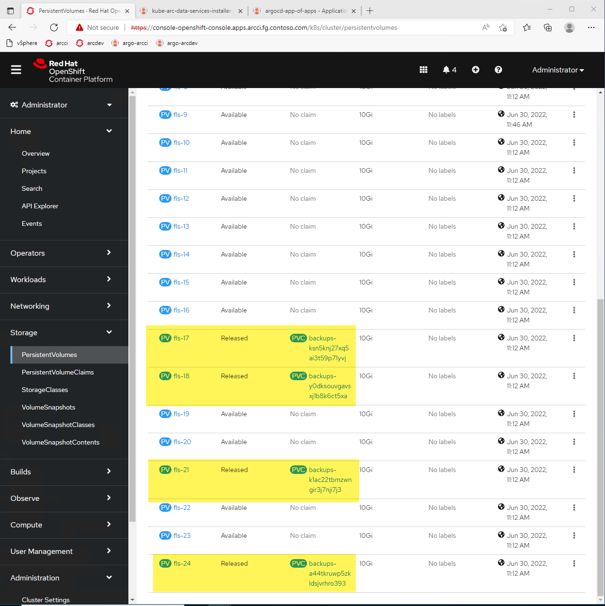
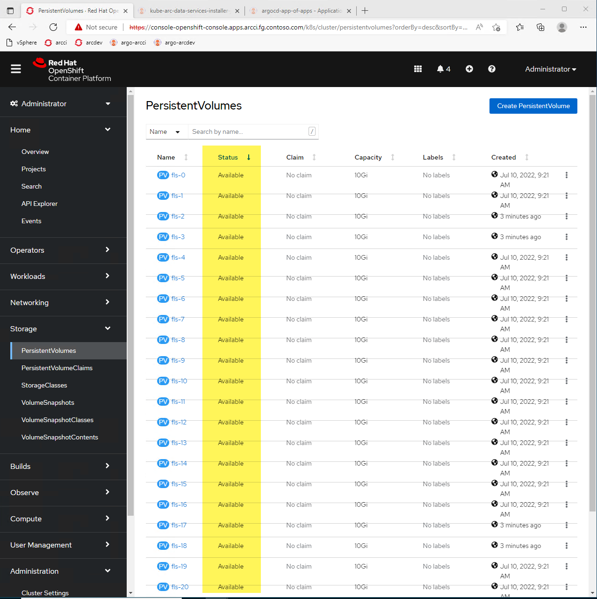

# Cleaning up Azure File Share PVs

After an env destruction, we want to clean up these FLS and also expand the number of PVCs (25 to 50, let's say):



```bash
# Connect to correct cluster
export KUBECONFIG=/workspaces/openshift-vsphere-install/openshift-install/secrets/arcci/auth/kubeconfig
kubectl get pv
# fls-17   10Gi       RWX            Retain           Released    azure-arc-data/backups-ksn5knj27xq5ai3t59p71yvj   azure-file              9d
# fls-18   10Gi       RWX            Retain           Released    azure-arc-data/backups-y0dksouvgavsxj1b8k6ct5xa   azure-file              9d
```

Run `./FLS-cleanup.sh` to:
* Delete `Released` PVs from K8s and ARM
* Reconcile with Terraform to re-create fresh PVs with K8s and ARM, changing `TF_VAR_pvshare_nums` causes Terraform to create net new PVs to match desired state

