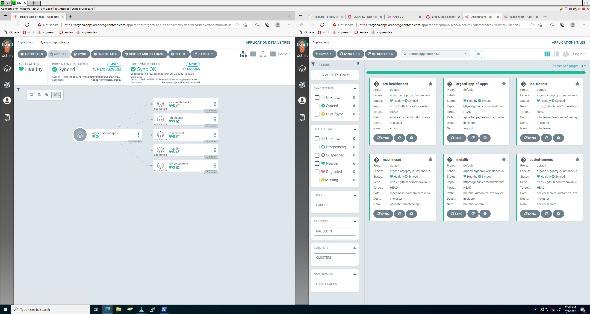

# Getting a quick `arcdev` cluster up

## `ocplab-dc1`

This is the part where we need to make a networking decision on where we want to allocate IP:
```PowerShell
# OpenShift Routes (2) + MetalLB (10)
Add-DhcpServerv4ExclusionRange -ScopeId $scopeID -StartRange 10.216.175.80 -EndRange 10.216.175.92

# Routes
$clusterName = 'arcdev'
$baseDomain = 'fg.contoso.com'
$ip1 = '10.216.175.80'
$ip2 = '10.216.175.81'

Add-DnsServerResourceRecordA -Name "api.$clusterName" -ZoneName $baseDomain -AllowUpdateAny -IPv4Address $ip1 -TimeToLive 01:00:00 -createptr
Add-DnsServerResourceRecordA -Name "*.apps.$clusterName" -ZoneName $baseDomain -AllowUpdateAny -IPv4Address $ip2 -TimeToLive 01:00:00 -createptr
```

## `devcontainer` prep

```bash
# = = = = = = = = = = = = = = = = = = = = = = = = =
# DNS tests
# = = = = = = = = = = = = = = = = = = = = = = = = =
nslookup api.arcdev.fg.contoso.com
# Address: 10.216.175.80
nslookup console-that-doesnt-exist-yet.apps.arcdev.fg.contoso.com
# Address: 10.216.175.81
nslookup quay.io
# Address: 3.227.212.61
nslookup arclab-vc.arclab.local
# Address: 10.216.173.11
nslookup arclab-wl-esxi-02.arclab.local
# Address: 10.216.152.12

# = = = = = = = = = = = = = = = = =
# Inject pre-existing SSH Key pair
# = = = = = = = = = = = = = = = = =
export secretPath='/workspaces/openshift-vsphere-install/openshift-install/secrets'

# View public key and add it
cat $secretPath/.ssh/id_ed25519.pub
ssh-add $secretPath/.ssh/id_ed25519

# = = = = = = = = = = = = = = = = = = = = = =
# Moving the OpenShift installation binary
# = = = = = = = = = = = = = = = = = = = = = =
export binaryPath='/workspaces/openshift-vsphere-install/openshift-install/binaries'
cd $binaryPath
tar -xvf openshift-install-linux.tar.gz
# README.md                 <- useless
# openshift-install         <- useful
rm README.md

cp openshift-install /usr/local/bin/
chmod +x /usr/local/bin/openshift-install

# = = = = = = = = = = = = = = = = = = = = = = = = = 
# Inject vCenter root CA Cert into this container
# = = = = = = = = = = = = = = = = = = = = = = = = = 
cd $secretPath
cp certs/lin/* /usr/local/share/ca-certificates
cp certs/lin/* /etc/ssl/certs
update-ca-certificates --verbose --fresh
# ...
# link Trustwave_Global_Certification_Authority.pem -> f249de83.0
# 127 added, 0 removed; done.
# Running hooks in /etc/ca-certificates/update.d...
# done.
```

## Deploy OpenShift

```bash
export installationDir='/workspaces/openshift-vsphere-install/openshift-install/secrets/arcdev'
mkdir -p $installationDir
cd $installationDir

# Copy previous install config in here
cp ../install-config/install-config.yaml install-config.yaml

# Replace env specific values
export config='/workspaces/openshift-vsphere-install/openshift-install/secrets/arcdev/install-config.yaml'
export ip1='10.216.175.80'
export ip2='10.216.175.81'
export cluster='arcdev'

# Replace values for this env
yq e "(.metadata.name |= \"$cluster\")" -i $config
yq e "(.platform.vsphere.apiVIP |= \"$ip1\")" -i $config
yq e "(.platform.vsphere.ingressVIP |= \"$ip2\")" -i $config

# Fire install
openshift-install create cluster --log-level=debug

# Validate via kubeconfig
export KUBECONFIG=/workspaces/openshift-vsphere-install/openshift-install/secrets/arcdev/auth/kubeconfig

oc get nodes
# NAME                        STATUS   ROLES    AGE   VERSION
# arcdev-qpxjq-master-0       Ready    master   21m   v1.23.5+3afdacb
# arcdev-qpxjq-master-1       Ready    master   21m   v1.23.5+3afdacb
# arcdev-qpxjq-master-2       Ready    master   21m   v1.23.5+3afdacb
# arcdev-qpxjq-worker-nwcpm   Ready    worker   12m   v1.23.5+3afdacb
# arcdev-qpxjq-worker-xq2wg   Ready    worker   12m   v1.23.5+3afdacb
```

## Post deploy enhancements

> We skip the LDAP stuff, let's just use kubeadmin for OpenShift login

```bash
# = = = = = = = = = = = = =
# Set default StorageClass
# = = = = = = = = = = = = =
oc patch storageclass thin -p '{"metadata": {"annotations":{"storageclass.kubernetes.io/is-default-class":"false"}}}'
oc patch storageclass thin-csi -p '{"metadata": {"annotations":{"storageclass.kubernetes.io/is-default-class":"true"}}}'

# = = = = = = = = = = = = =
# Deploy ArgoCD
# = = = = = = = = = = = = =
# Argo namespace
kubectl create namespace argocd

# Apply massive YAML in Argo Namespace
kubectl apply -n argocd -f /workspaces/openshift-vsphere-install/ArgoCD/install/argo.yaml

# Creates route to access UI
cat << EOF | oc apply -f -
apiVersion: route.openshift.io/v1
kind: Route
metadata:
  name: argocd-route
  namespace: argocd
spec:
  host: argocd.apps.${cluster}.fg.contoso.com
  port:
    targetPort: http
  tls:
    termination: passthrough 
    insecureEdgeTerminationPolicy: None 
  to:
    kind: Service
    name: argocd-server
    weight: 100
  wildcardPolicy: None
EOF
# route.route.openshift.io/argocd-route created

# Change Argo password secret to "password" and change time of patch to now
kubectl -n argocd patch secret argocd-secret \
  -p '{"stringData": {
    "admin.password": "$2a$10$rRyBsGSHK6.uc8fntPwVIuLVHgsAhAX7TcdrqW/RADU0uh7CaChLa",
    "admin.passwordMtime": "'$(date +%FT%T%Z)'"
  }}'

# Sealed secrets
export NAMESPACE="sealed-secrets"
kubectl create namespace "$NAMESPACE"
kubectl apply -f /workspaces/openshift-vsphere-install/.devcontainer/.keys/sealed-secrets-secret.yaml

# Onboard to App of App - we have already created the Overlay folder in the AOA git
cat << EOF | oc apply -f -
apiVersion: argoproj.io/v1alpha1
kind: Application
metadata:
  name: argocd-app-of-apps
  namespace: argocd
spec:
  project: default
  source:
    repoURL: 'https://github.com/mdrakiburrahman/openshift-app-of-apps.git'
    path: app-of-apps/kustomize/overlays/${cluster}
    targetRevision: HEAD
  destination:
    server: https://kubernetes.default.svc
    namespace: argocd
  syncPolicy:
    automated:
      prune: true
      selfHeal: true
    syncOptions:
      - Validate=false
      - CreateNamespace=false
EOF
```

Result:

