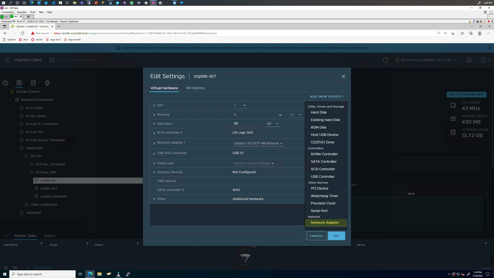
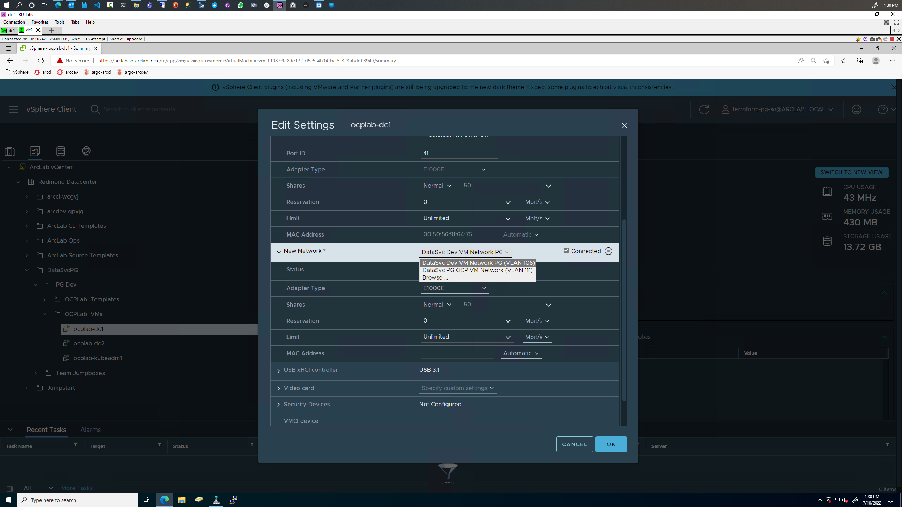
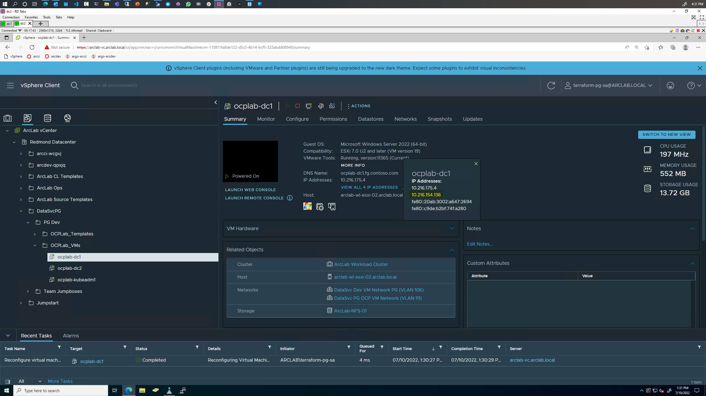
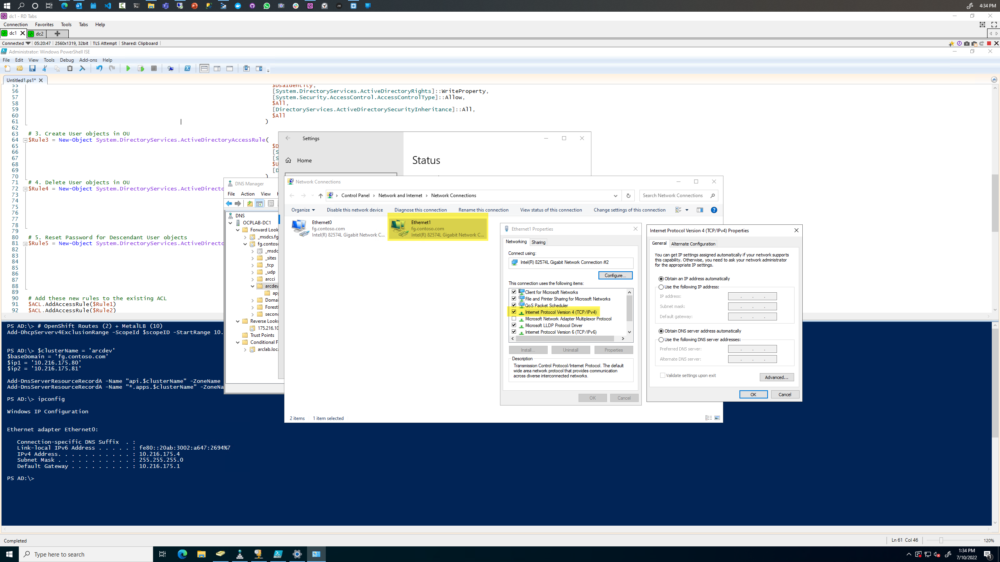
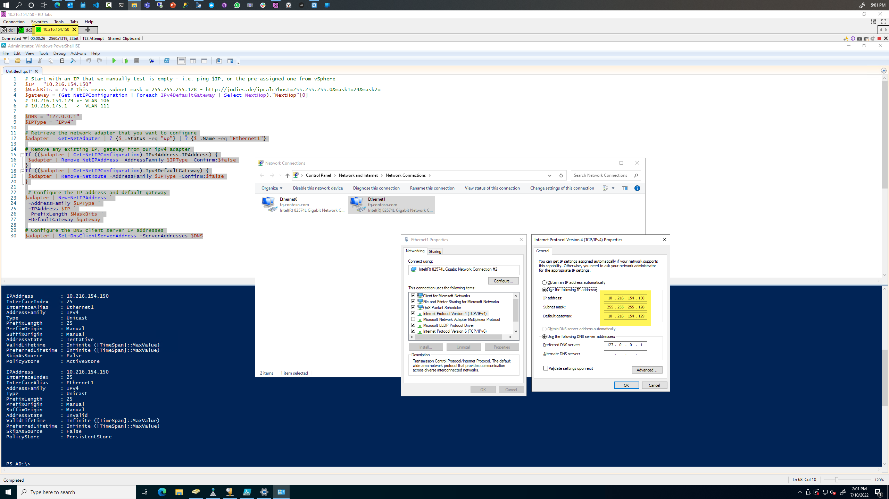
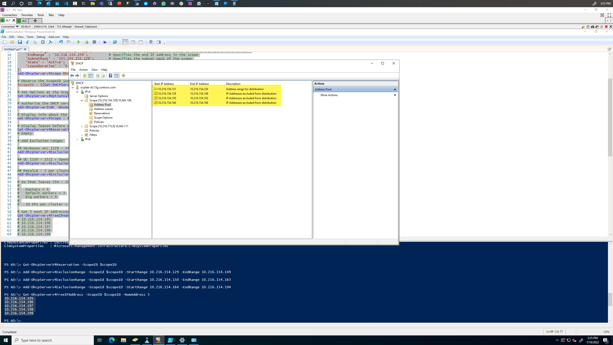
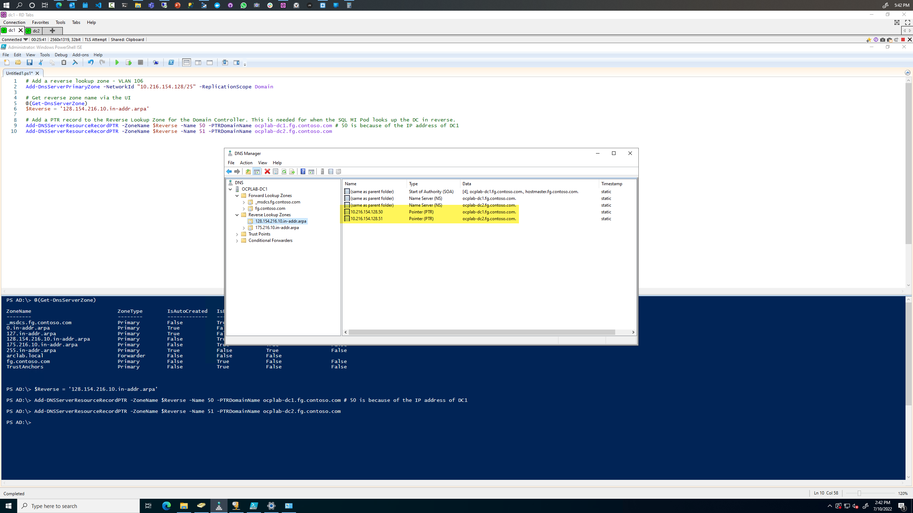
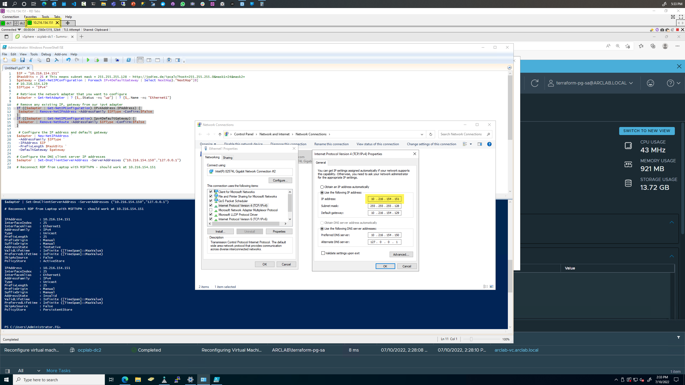

# Add `VLAN 106`

> Currently the VMs is deployed into `VLAN-111`, let's add another VLAN and onboard it as a first class citizen to support more Clusters + IPs

## DC1

### Add Network Adapter through vSphere

We add the VLAN manually to DC1, and see it get assigned an IP from the pool:









### Set Static IP Address

```powershell

# Start with an IP that we manually test is empty, leaving room for more devboxes - i.e. ping $IP, or the pre-assigned one from vSphere
$IP = "10.216.154.193"
$MaskBits = 26 # This means subnet mask = 255.255.255.192 - http://jodies.de/ipcalc?host=255.255.255.0&mask1=24&mask2=
$gateway = (Get-NetIPConfiguration | Foreach IPv4DefaultGateway | Select NextHop)."NextHop"[0]
# 10.216.154.129 <- VLAN 106
# 10.216.175.1   <- VLAN 111

$DNS = "127.0.0.1"
$IPType = "IPv4"

# Retrieve the network adapter that you want to configure
$adapter = Get-NetAdapter | ? {$_.Status -eq "up"} | ? {$_.Name -eq "Ethernet1"}

# Remove any existing IP, gateway from our ipv4 adapter
If (($adapter | Get-NetIPConfiguration).IPv4Address.IPAddress) {
 $adapter | Remove-NetIPAddress -AddressFamily $IPType -Confirm:$false
}
If (($adapter | Get-NetIPConfiguration).Ipv4DefaultGateway) {
 $adapter | Remove-NetRoute -AddressFamily $IPType -Confirm:$false
}

 # Configure the IP address and default gateway
$adapter | New-NetIPAddress `
 -AddressFamily $IPType `
 -IPAddress $IP `
 -PrefixLength $MaskBits `
 -DefaultGateway $gateway

# Configure the DNS client server IP addresses
$adapter | Set-DnsClientServerAddress -ServerAddresses $DNS

# Reconnect RDP from Laptop with MSFTVPN - should work at 10.216.154.193
```

For example - we see:



### Add DHCP Scope

```powershell
$dnsServerIP = (Get-NetIPAddress | Where-Object {$_.AddressState -eq "Preferred" -and $_.PrefixLength -eq 26}).IPAddress
# The 26 filter above is because of our mask we set previously

$domainName = 'fg.contoso.com'
$gateway = (Get-NetIPConfiguration | Foreach IPv4DefaultGateway | Select NextHop)."NextHop"[0]
# 10.216.154.129

$hostname = hostname

# Add the DHCP scope to this DC server - from VLAN mapping
# Create an IPv4 DHCP Server Scope
$HashArgs = @{
    'Name' = 'VLAN-106';                    # Redmond VLAN 106 mapping
    'Description' = 'Kubernetes CI Lab 2';  # This is the human-readable description of the scope
    'StartRange' = '10.216.154.194';        # We start later because other devboxes etc are present in this VLAN
    'EndRange' = '10.216.154.254';          # Specifies the end IP address in the scope
    'SubnetMask' = '255.255.255.192';       # Specifies the subnet mask of the scope
    'State' = 'Active';                     # Activates the scope
    'LeaseDuration' = '0.00:30:00';         # Specifies the length of the lease duration - 30 mins
}
Add-DhcpServerv4Scope @HashArgs

# Observe the ScopeID just created
$scopeID = ((Get-DHCPServerV4Scope) | ? {$_.Name -eq "VLAN-106"}).ScopeId.IPAddressToString

# Set Options at the Scope level
Set-DhcpServerv4OptionValue -ScopeID $scopeID -DNSServer $dnsServerIP -DNSDomain $domainName -Router $gateway

# Authorize the DHCP server
Add-DhcpServerInDC -DnsName "$hostname.$domainName"

# Display info about the 2 scopes
Get-DhcpServerv4Scope | Select-Object -Property *

# Display leases before adding other VMs
Get-DhcpServerV4Reservation -ScopeID $scopeID
# Empty

# Add Exclusion ranges

## DC [194] + OpenShift Routes for 4 clusters = 8 IPs [195-203]
Add-DhcpServerv4ExclusionRange -ScopeId $scopeID -StartRange 10.216.154.194 -EndRange 10.216.154.203

## MetalLB - 3 per cluster = 12 IPs [204 - 216]
Add-DhcpServerv4ExclusionRange -ScopeId $scopeID -StartRange 10.216.154.204 -EndRange 10.216.154.216

# So that leaves 254 - 216 = 38 IPs for actual workers - each of our 4 clusters can look like this:
#
#   Masters = 3
#   Default workers = 1
#   Big workers = 5
#
#   9 IPs per cluster = 36 IPs, roughly

# Get 5 next IP Addresses that are free
Get-DhcpServerv4FreeIPAddress -ScopeID $scopeID -NumAddress 5
# 10.216.154.217
# 10.216.154.218
# 10.216.154.219
# 10.216.154.220
# 10.216.154.221
```



### Add a Reverse Lookup Zone on ocplab-dc1

```powershell
# Add a reverse lookup zone - VLAN 106
Add-DnsServerPrimaryZone -NetworkId "10.216.154.192/26" -ReplicationScope Domain

# Get reverse zone name via the UI
$Reverse = '192.154.216.10.in-addr.arpa'

# Add a PTR record to the Reverse Lookup Zone for the Domain Controllers. This is needed for when the SQL MI Pod looks up the DC in reverse.
Add-DNSServerResourceRecordPTR -ZoneName $Reverse -Name 193 -PTRDomainName ocplab-dc1.fg.contoso.com
Add-DNSServerResourceRecordPTR -ZoneName $Reverse -Name 194 -PTRDomainName ocplab-dc2.fg.contoso.com 
```



---

## DC2

### Add Network Adapter through vSphere

> Identical steps as above


### Set Static IP Address

```powershell
$IP = "10.216.154.194"
$MaskBits = 26 # This means subnet mask = 255.255.255.192 - http://jodies.de/ipcalc?host=255.255.255.0&mask1=24&mask2=
$IPType = "IPv4"

# Retrieve the network adapter that you want to configure
$adapter = Get-NetAdapter | ? {$_.Status -eq "up"} | ? {$_.Name -eq "Ethernet1"}

# Remove any existing IP, gateway from our ipv4 adapter
If (($adapter | Get-NetIPConfiguration).IPv4Address.IPAddress) {
 $adapter | Remove-NetIPAddress -AddressFamily $IPType -Confirm:$false
}
If (($adapter | Get-NetIPConfiguration).Ipv4DefaultGateway) {
 $adapter | Remove-NetRoute -AddressFamily $IPType -Confirm:$false
}

 # Configure the IP address and default gateway
$adapter | New-NetIPAddress `
 -AddressFamily $IPType `
 -IPAddress $IP `
 -PrefixLength $MaskBits `
 -DefaultGateway '10.216.154.129'

# Configure the DNS client server IP addresses
$adapter | Set-DnsClientServerAddress -ServerAddresses ("10.216.154.193","127.0.0.1")

# Reconnect RDP from Laptop with MSFTVPN - should work at 10.216.154.194
```

